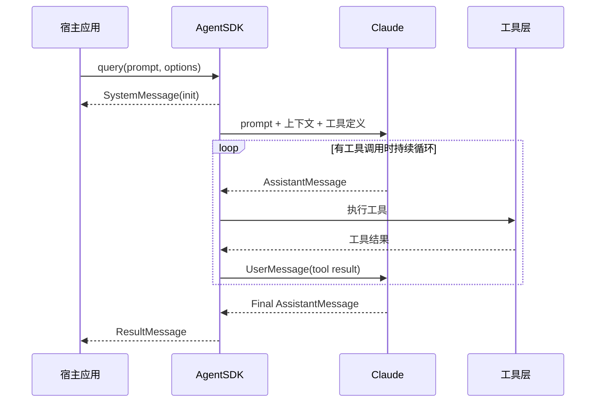

## 当前 Agent 的问题

第一章之后，你已经能跑通一个最小 agent，但你现在只能看到最后的结果，看不到 Claude 是怎么一步步完成任务的。

这会直接带来三个问题：

- 你不知道 Claude 是什么时候决定调用工具的。
- 你不知道工具结果是如何重新回到模型上下文中的。
- 你没法为后面的实时 UI、审批、日志、成本统计设计正确的数据流。

所以这一章的目标不是增加新能力，而是把“执行过程”看清楚。

## 本章功能的作用

这一章会让你理解 Agent SDK 的执行循环，也就是 agent loop。

你需要掌握四类最重要的消息：

- `SystemMessage`
- `AssistantMessage`
- `UserMessage`
- `ResultMessage`

只要这四类消息的边界没有看清，你就很难真正理解 Agent SDK 的执行模型。因为 Claude 并不是“想完一次就结束”，而是在消息流里不断地产生意图、接收工具结果、再继续推进。后面所有 UI、日志、审批和监控，最终都是围绕这些消息类型展开的。

官方文档里有一个很关键的细节：`maxTurns` 统计的是“带工具调用的回合”，不是所有输出消息的条数。因此你在阅读消息流时，不能把“出现了几条 assistant 文本”简单等同为“走了几轮 agent loop”。

把一次典型消息回流画成时序图，大致就是下面这样：



## 具体使用方式

### 第一步：把 `query()` 的返回值当成事件流

这一章的核心用法，不是“怎么拿最终文本”，而是“怎么逐条处理消息”。最常见写法就是：

```ts
for await (const message of query(...)) {
  // inspect message.type
}
```

你应该在这里按 `message.type` 分支，而不是把所有消息都混在一起处理。

这不是代码风格问题，而是架构问题。如果你的程序从一开始就不区分消息类型，那么以后只要需求一复杂，比如“流式展示文本但把系统消息只写日志”，就不得不重构整条链路。

另外，`ResultMessage` 并不意味着“流里此后绝对不会再有任何系统事件”。官方文档特别提醒，极少数尾随系统事件仍可能出现在结果之后，所以真正稳妥的写法是把整个异步迭代完整消费完，而不是一看到 `result` 就立即中断循环。

### 第二步：先识别 `system` 消息

`system` 消息通常用来做初始化感知和系统级日志记录。例如在 UI 启动时，可以用 `init` 事件确认这次会话已经建立完成。

很多看起来“不属于业务结果”的信息，其实都应该在这一层处理。比如会话初始化、上下文压缩边界、某些底层运行时状态。这类消息未必展示给最终用户，但对排查执行问题非常重要。

### 第三步：再处理 `assistant` 和 `user`

`assistant` 表示 Claude 的输出，包括文本块和工具调用块。`user` 在这里通常不是用户手工输入，而是工具执行结果回流到会话中的包装消息。理解这一点后，你才能真正看懂“工具结果是怎样重新进入 Claude 上下文”的。

`user` 在 agent loop 里的这个含义尤其容易被误解。这里它更像“会话里的新输入事件”，而不是“终端前的人类又打了一句话”。工具结果之所以能推动 Claude 继续思考，就是因为它被包装成了这种可重新进入上下文的消息。

### 第四步：最后在 `result` 处收口

`result` 才是单次 query 的完成信号。像 `session_id`、`usage`、`total_cost_usd` 这样的收尾信息，都应该在这里统一读取。

在实际系统里，`result` 通常会对应一次任务状态变更，例如“完成”“失败”“取消”。所以你最好把它当成一个明确的收尾阶段，而不是普通消息流里的又一个文本块。

## 关键概念

### 什么是一个 turn

一个 turn 可以理解为一次完整的执行往返：

1. Claude 根据当前上下文产出文本和工具调用意图。
2. SDK 执行 Claude 请求的工具。
3. 工具结果被包装回消息流，再送回 Claude。
4. Claude 基于新结果继续判断下一步。

只要 Claude 还想继续调用工具，turn 就会不断重复。

### 四类关键消息分别做什么

#### `SystemMessage`

表示系统级事件，最常见的是：

- `init`：会话初始化
- `compact_boundary`：上下文压缩边界

#### `AssistantMessage`

表示 Claude 在某一轮输出的内容，可能包含：

- 普通文本块
- 工具调用块

#### `UserMessage`

这里的 `UserMessage` 不是“你手工输入的新消息”，而是“工具执行结果回流给 Claude 之后的消息包装”。

#### `ResultMessage`

表示整次 `query()` 结束。它通常包含：

- `subtype`
- `result`
- `session_id`
- `usage`
- `total_cost_usd`

### 为什么消息流比最终字符串更重要

因为后面的所有高级能力都依赖它：

- 流式输出依赖增量消息
- 审批依赖工具请求时机
- checkpointing 依赖 user message UUID
- cost tracking 依赖 result

## 可运行示例

把下面代码保存为 `chapter-02-message-flow.ts`：

```ts
import { mkdtemp, writeFile, rm } from "node:fs/promises";
import { tmpdir } from "node:os";
import { join } from "node:path";
import { query } from "@anthropic-ai/claude-agent-sdk";

async function main() {
  const workspace = await mkdtemp(join(tmpdir(), "agent-sdk-ch02-"));

  try {
    await writeFile(join(workspace, "README.md"), "# Demo App\n\nA tiny demo app.\n", "utf8");
    await writeFile(join(workspace, "auth.ts"), "export const token = 'demo';\n", "utf8");

    for await (const message of query({
      prompt: "Summarize this project and tell me which files you inspected.",
      options: {
        cwd: workspace,
        allowedTools: ["Read", "Glob", "Grep"],
        permissionMode: "dontAsk"
      }
    })) {
      if (message.type === "system") {
        console.log("[system]", message.subtype);
      } else if (message.type === "assistant") {
        console.log("[assistant] content blocks:", message.message.content.length);
      } else if (message.type === "user") {
        console.log("[user-message] tool result returned to Claude");
      } else if (message.type === "result") {
        console.log("[result]", message.subtype);
        console.log("session:", message.session_id);
        console.log(message.result);
      }
    }
  } finally {
    await rm(workspace, { recursive: true, force: true });
  }
}

main().catch((error) => {
  console.error(error);
  process.exit(1);
});
```

运行：

```bash
npx tsx chapter-02-message-flow.ts
```

## 示例拆解

### 第一步：准备一个最小但足以触发工具的工作区

示例写入了 `README.md` 和 `auth.ts`，目的不是演示业务逻辑，而是让 Claude 在总结项目时确实需要调用 `Glob`、`Read` 或 `Grep`。

### 第二步：在循环里按消息类型分别打印

示例不是简单 `console.log(message)`，而是对 `system`、`assistant`、`user`、`result` 分别输出。这样你能直观看到一次任务里“初始化 -> 思考/调用工具 -> 工具回流 -> 最终结果”的顺序。

这段输出虽然朴素，但它提供了一种非常重要的调试视角。以后只要你怀疑“为什么 Claude 没调用工具”“为什么调用工具后没有继续分析”，都应该先回到消息流里看顺序和类型是不是符合预期。

### 第三步：通过 `assistant` 消息确认 Claude 的输出形态

`assistant` 分支里打印了 `content.length`，目的是提醒你：Claude 的一次输出并不一定是一段完整字符串，它可能由多个内容块组成。

### 第四步：通过 `result` 读取会话收尾信息

示例在 `result` 阶段打印 `session_id` 和最终结果，这一步是后续接会话恢复、成本统计、日志落盘的基础。

## 运行时你应该观察什么

你通常会看到这样的节奏：

- `system/init`
- 一个或多个 `assistant`
- 一个或多个 `user-message`
- 最终 `result`

即便输出顺序会因任务复杂度变化，整体模式不会变。

## 这一章最容易忽略的点

- `ResultMessage` 才是结束信号，不要看到一个 assistant 文本就认为任务结束了。
- 一次 `query()` 里可以发生很多轮工具调用，不要把它当成单轮 completion。
- `UserMessage` 在这里主要是“工具结果回流”，这和聊天应用里“用户消息”的语义不完全一样。

## 本章结束后你应该掌握

- agent loop 的基本节奏
- 四类关键消息的职责分工
- 为什么 UI、日志、审批、观测都必须围绕消息流设计

## 本章小结

从这一章开始，你不再只是“会调用 SDK”，而是开始理解 SDK 的运行时模型。这种理解会直接决定你后面写出来的是 demo 还是可维护系统。
