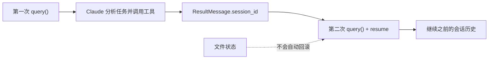

## 当前 Agent 的问题

第二章之后，你已经看懂了 agent loop，但当前 agent 仍然像“短时记忆体”：每次重新调用 `query()`，它都像刚刚启动一样。

这会带来非常实际的工程问题：

- 第一个问题刚分析完，第二个问题还要重新解释上下文。
- 长任务中断后，恢复代价很高。
- 你无法把 agent 做成真正的多轮协作助手。

所以这一章的切入点很简单：让 agent 记住自己刚才做过什么。

## 本章功能的作用

这一章会引入会话持久化，也就是 session。

你要掌握的能力包括：

- 从 `ResultMessage` 保存 `session_id`
- 使用 `resume` 恢复指定历史会话

从效果上说，这一章解决的是“让 agent 具备连续记忆”。没有 session，每一次调用都像全新开局；有了 session，Claude 才能把上一轮已经形成的分析、工具调用背景和任务进度带到下一轮。

官方文档还把几种续接方式区分得很清楚。除了显式 `resume` 指定某个 session ID，TypeScript 里还有 `continue: true` 用来自动接上当前目录最近的一次会话。教程里先讲 `resume`，是因为它更适合多用户、多任务场景，也最能帮助学习者理解 session 是怎样被显式管理的。

可以先把 session 理解成下面这条续接链：



## 具体使用方式

### 第一步：在第一次调用结束时保存 `session_id`

`session_id` 会出现在 `result` 消息上。真正可用的做法不是“打印出来看看”，而是在你的应用里把它和用户、任务或聊天窗口绑定保存起来。

这一步的关键不在技术接口，而在业务建模。`session_id` 只是 Claude 侧的标识，真正决定你系统是否能稳定续跑的是：你有没有把它和自己的用户、工单、会话窗口或者任务单元建立稳定映射。

另外，官方实现会把 session 自动持久化到本地磁盘，而不是只存在内存里。但它的定位仍然是“会话历史存储”，不是跨机器自动同步方案。只要运行目录或宿主机器变了，你就必须自己处理 session 文件同步或外部存储。

### 第二步：下一次调用时通过 `resume` 接回上下文

当你希望 Claude 继续上一轮任务时，在 `options` 里传入 `resume: sessionId`。这样 Claude 会继承之前的会话历史，而不是重新从空白上下文开始。

这意味着第二轮 prompt 往往可以非常短。因为你不再需要把前情提要、已知风险、已经看过的文件重新说一遍。Claude 会把这些都视为同一段持续会话的一部分。

### 第三步：保持相同工作区

`resume` 恢复的是会话历史，不是文件系统快照。因此最稳妥的做法是让恢复调用继续使用同一个 `cwd`，否则 Claude 虽然“记得”上次谈了什么，但磁盘环境可能已经不是同一份。

### 第四步：把“分析”和“执行”拆成两个回合

学习阶段最适合的使用方式是：第一轮只读和分析，第二轮在 `resume` 的基础上开始写文件。这样最容易看清 session 真正保存的是什么。

这种两阶段用法在生产环境里也很常见。很多团队会先让 agent 审查、列风险、出方案，确认后再让它继续执行修改。session 的价值就在于，这两个阶段之间不用重新解释上下文。

如果你在第二轮恢复时发现 Claude 像失忆了一样，最常见原因不是 `resume` 参数无效，而是 `cwd` 变了。官方文档明确提到，session 是按工作目录归档的；目录一变，SDK 就可能去错误的位置查找会话记录。

## 关键概念

### Session 保存的是什么

Session 保存的是对话历史，包括：

- 用户 prompt
- Claude 的中间分析
- 工具调用
- 工具结果

所以 `resume` 之后，Claude 可以继续基于前面的分析结果往下工作。

### Session 不保存什么

它不保存文件快照。

这意味着：

- `resume` 能恢复“认知状态”
- `resume` 不能恢复“磁盘状态”

如果你要回滚文件，要到第 17 章使用 checkpointing。

### 为什么 `session_id` 很重要

如果你的应用面向多个用户，通常要自己维护“用户 -> session_id”映射。否则用户之间的上下文会串线。

## 可运行示例

把下面代码保存为 `chapter-03-sessions.ts`：

```ts
import { mkdtemp, writeFile, readFile, rm } from "node:fs/promises";
import { tmpdir } from "node:os";
import { join } from "node:path";
import { query } from "@anthropic-ai/claude-agent-sdk";

async function main() {
  const workspace = await mkdtemp(join(tmpdir(), "agent-sdk-ch03-"));

  try {
    await writeFile(
      join(workspace, "auth.ts"),
      [
        "export function getUserName(user?: { name?: string }) {",
        "  return user!.name!.toUpperCase();",
        "}",
        ""
      ].join("\n"),
      "utf8"
    );

    let sessionId: string | undefined;

    for await (const message of query({
      prompt: "Analyze auth.ts and describe the crash risks, but do not edit the file yet.",
      options: {
        cwd: workspace,
        allowedTools: ["Read", "Glob", "Grep"],
        permissionMode: "dontAsk"
      }
    })) {
      if (message.type === "result") {
        sessionId = message.session_id;
        console.log("Analysis result:\n");
        console.log(message.result);
      }
    }

    for await (const message of query({
      prompt: "Now fix the crash risks you just described.",
      options: {
        cwd: workspace,
        resume: sessionId,
        allowedTools: ["Read", "Edit", "Write", "Glob", "Grep"],
        permissionMode: "acceptEdits"
      }
    })) {
      if (message.type === "result") {
        console.log("\nFix result:\n");
        console.log(message.result);
      }
    }

    const updated = await readFile(join(workspace, "auth.ts"), "utf8");
    console.log("\nUpdated auth.ts:\n");
    console.log(updated);
  } finally {
    await rm(workspace, { recursive: true, force: true });
  }
}

main().catch((error) => {
  console.error(error);
  process.exit(1);
});
```

运行：

```bash
npx tsx chapter-03-sessions.ts
```

## 示例拆解

### 第一步：第一轮只做风险分析

第一轮 query 只开放 `Read`、`Glob`、`Grep`，故意不给编辑权限。它的功能是让 Claude 先建立问题理解，并在 `result` 里返回风险分析。

### 第二步：在第一轮结束时记录 `sessionId`

示例把 `message.session_id` 存到变量里。这一步是 session 的关键，没有它，第二轮就无法恢复上一轮的认知上下文。

### 第三步：第二轮通过 `resume` 直接进入修复

第二轮 prompt 不再重复解释 `auth.ts` 的问题，而是直接说“修掉你刚才描述的风险”。如果 Claude 能顺利继续工作，就说明恢复的是同一条会话链。

这个设计刻意把第二轮 prompt 写得很短，就是为了验证“Claude 到底记不记得刚才发生了什么”。如果 session 恢复没生效，这样的 prompt 往往会显得信息不足；如果恢复成功，它反而是最自然的续写方式。

### 第四步：最后读取磁盘上的真实文件

示例用 `readFile()` 再读一次 `auth.ts`，目的是把“会话恢复成功”变成可见结果，而不是只相信终端里的自然语言说明。

## 运行时你应该观察什么

- 第一轮只分析，不修改文件。
- 第二轮没有重新解释第一轮上下文，但能直接继续修复。
- 最终 `auth.ts` 应该被更新成更安全的实现。

## 易错点

- `resume` 依赖工作目录一致，切换 `cwd` 可能导致找不到原 session。
- Session 默认存在本地磁盘，跨机器恢复需要你自己处理存储同步。

## 本章结束后你应该掌握

- 什么时候应该保存 `session_id`
- `resume` 适合解决什么问题
- 为什么 session 不能替代文件回滚

## 本章小结

到这里，agent 已经从“一次性任务执行器”升级成了“可持续协作对象”。这会直接影响你后面如何做聊天界面、任务续跑和长流程自动化。
