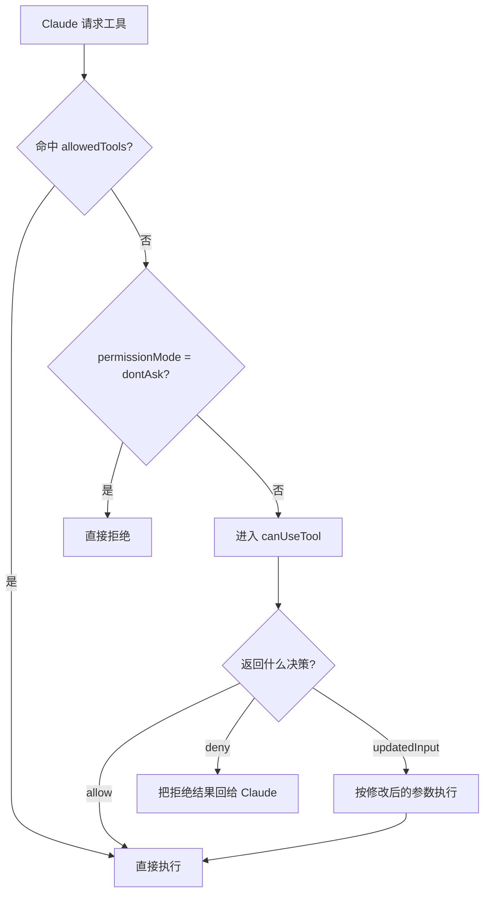

## 当前 Agent 的问题

第五章之后，你的 agent 已经能实时输出，但执行链仍然存在一个严重问题：Claude 一旦判断要调用工具，你的应用几乎没有参与决策的机会。

这在真实环境中马上会引发风险：

- 哪些写文件动作可以直接放行？
- 哪些命令必须人工确认？
- 当 Claude 需要用户澄清“应该选 A 还是 B”时，问题要如何回到界面层？

所以这一章的目标，是把“模型决定执行什么”变成“模型提出请求，应用决定是否执行”。

## 本章功能的作用

这一章会引入运行时审批接口 `canUseTool`。

你可以用它做三类事：

- 允许执行
- 拒绝执行
- 修改参数后执行

真正的价值在于，agent 从这里开始不再是一个“模型判断了就直接做”的黑盒，而是一个要经过宿主系统策略检查的执行体。也就是说，Claude 可以提出动作请求，但最终是否执行、按什么参数执行，控制权回到了你的应用手里。

而且这一套入口不只处理“危险工具审批”，也处理 Claude 主动发起的澄清问题。官方文档明确说明，`AskUserQuestion` 也会走进同一条回调链，所以从宿主应用视角看，“权限请求”和“需要用户回答的问题”本质上都是等待你返回决策的暂停点。

如果只看运行时审批这一层，执行路径可以先概括成下面这张图：



## 具体使用方式

### 第一步：让未预批准工具进入审批链

如果你希望工具调用先经过宿主应用判断，就不要把相关工具直接放进 `allowedTools`。同时把 `permissionMode` 设成 `default`，这样 Claude 的请求才会进入 `canUseTool`。

很多初学者会同时把工具加入 `allowedTools`，又期待 `canUseTool` 再弹一次审批，这是最常见误区之一。`allowedTools` 的含义本来就是预先放行，所以真正需要审批的能力，应该留在运行时决策链里。

还要注意一个非常实际的行为差异：`dontAsk` 模式下，未预批准工具会直接被拒绝，根本不会再进入 `canUseTool`。这也是为什么真正要做交互式审批时，通常应该从 `default` 模式起步，而不是从 `dontAsk` 起步。

### 第二步：在 `canUseTool` 里读取 `toolName` 和 `input`

这个回调的核心职责，是让你的应用拿到“Claude 想做什么”。你应该在这里检查工具名、目标路径、命令参数，或者任何与你业务策略相关的字段。

这一层判断应该尽量结构化，而不是靠字符串模糊匹配。例如写文件时检查 `file_path`，执行命令时检查命令白名单，访问外部资源时检查域名或资源 ID。这样策略才可维护，也更容易审计。

官方接口里 `toolName` 和 `input` 已经是按工具语义拆好的结构，所以教程里推荐直接使用这些字段，而不是先把请求序列化成一整段字符串再自己解析回来。

### 第三步：返回明确的行为决策

你可以返回三种主要结果：`allow`、`deny`、`allow + updatedInput`。这意味着 `canUseTool` 不只是审批按钮，也可以作为参数改写层。

其中 `updatedInput` 非常实用。它让你不必在“全放行”和“全拒绝”之间二选一，而是可以把请求修正到安全范围内，例如把输出路径重定向到沙箱目录，或者替换掉不允许的命令参数。

从产品实现角度看，这意味着 `canUseTool` 不只是一个审批弹窗接口，还是一个轻量级策略执行器。很多看似需要“拦住 Claude 重说一遍”的场景，其实可以直接通过改写输入安全地继续推进。

### 第四步：把策略写成代码，而不是藏在 prompt 里

审批逻辑属于运行时治理，不属于自然语言约束。真正可靠的做法，是把“哪些文件能写、哪些命令能跑”写进回调代码里。

## 关键概念

### `canUseTool` 什么时候触发

当 Claude 想使用一个没有被自动批准的工具时，SDK 会调用 `canUseTool`。你会拿到：

- `toolName`
- `input`

然后你必须返回一个决策对象。

### 它不只是审批弹窗

你完全可以把它当成策略引擎，比如：

- 只允许写入某个特定文件
- 拒绝任何 Bash
- 自动把某些路径重写到沙箱目录后再放行

### 它和 `allowedTools`、`permissionMode` 的关系

- `allowedTools`：预批准某些工具
- `permissionMode`：决定未匹配规则时的默认行为
- `canUseTool`：运行时裁决点

这三者不是替代关系，而是分层关系。

## 可运行示例

把下面代码保存为 `chapter-06-approval.ts`：

```ts
import { mkdtemp, rm, readFile } from "node:fs/promises";
import { tmpdir } from "node:os";
import { join } from "node:path";
import { query } from "@anthropic-ai/claude-agent-sdk";

async function main() {
  const workspace = await mkdtemp(join(tmpdir(), "agent-sdk-ch06-"));

  try {
    for await (const message of query({
      prompt: "Create a file named safe-notes.md with three bullet points about why runtime approvals are useful.",
      options: {
        cwd: workspace,
        permissionMode: "default",
        canUseTool: async (toolName, input) => {
          console.log("Tool request:", toolName, input);

          if (toolName === "Write") {
            const filePath = String((input as { file_path?: string }).file_path ?? "");
            if (filePath.endsWith("safe-notes.md")) {
              return { behavior: "allow", updatedInput: input };
            }
            return {
              behavior: "deny",
              message: "Only safe-notes.md may be created in this demo."
            };
          }

          return {
            behavior: "deny",
            message: `Tool ${toolName} is not allowed in this demo.`
          };
        }
      }
    })) {
      if (message.type === "result") {
        console.log("\nResult status:", message.subtype);
        console.log(message.result);
      }
    }

    const created = await readFile(join(workspace, "safe-notes.md"), "utf8");
    console.log("\nCreated file:\n");
    console.log(created);
  } finally {
    await rm(workspace, { recursive: true, force: true });
  }
}

main().catch((error) => {
  console.error(error);
  process.exit(1);
});
```

运行：

```bash
npx tsx chapter-06-approval.ts
```

## 示例拆解

### 第一步：脚本创建一个空白临时目录

这里故意不预先放置目标文件，是因为我们要观察 Claude 是否真的通过 `Write` 工具把 `safe-notes.md` 创建出来。

### 第二步：`query()` 使用 `permissionMode: "default"`

这一行很关键。它的作用是告诉 SDK：遇到未自动放行的工具请求时，不要直接执行，也不要直接拒绝，而是交给运行时策略处理。

### 第三步：`canUseTool` 只放行一个固定路径

回调里先判断 `toolName === "Write"`，再检查 `file_path` 是否以 `safe-notes.md` 结尾。这样读者可以非常清楚地看到“工具审批是按具体请求裁决的”。

这个例子虽然简单，但它对应的是生产环境里非常常见的一类策略：允许模型做事，但只允许它在非常明确的边界内做。与其相信“请不要乱改文件”这类提示词，不如用代码直接把允许范围写死。

### 第四步：最后读取真实文件验证审批结果

示例不是只看 Claude 的说明，而是再次读取磁盘文件内容。只要文件存在且内容正确，就说明这次 `allow` 真正放行了写操作。

## 运行时你应该观察什么

- Claude 会尝试请求 `Write`
- `canUseTool` 会先接收到请求
- 只有当目标路径是 `safe-notes.md` 时，请求才会被放行
- 最终文件会真的被写到临时目录里

## 一个重要提醒

在 TypeScript SDK 中，这个示例可以直接工作；Python 版本的 `can_use_tool` 还需要配合 streaming 模式与额外 hook 才能保持连接，这是官方文档里特别强调过的差异。

## 易错点

- 如果工具已经被 `allowedTools` 预批准，`canUseTool` 未必会再次介入。
- `dontAsk` 模式会直接拒绝未批准工具，可能根本不会进入你的审批 UI。

## 本章结束后你应该掌握

- `canUseTool` 的触发时机
- 如何把工具请求转化为宿主应用策略
- 为什么权限边界应该由代码和配置共同保证，而不是只靠 prompt

## 本章小结

到这里，你的 agent 已经不再是一个“可以随意调工具的自动体”，而是一个必须经过宿主系统审核的可控执行体。
