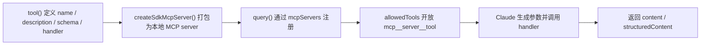

## 当前 Agent 的问题

第十一章之后，你已经能加载团队能力包，但 agent 仍然只能使用：

- 内建工具
- 现成的 skills / commands / plugins

如果你现在想让 Claude 调用自己的业务逻辑，例如：

- 一个内部定价函数
- 一个查询公司制度的 API
- 一个你自己写的换算器或业务规则引擎

那就需要自定义工具。

## 本章功能的作用

这一章会引入：

- `tool()`
- `createSdkMcpServer()`
- `mcpServers`

自定义工具最终会被挂到一个进程内 MCP server 上，这也是为什么它和外部 MCP server 在 Claude 看来几乎是同一类能力。

它解决的根本问题是：Claude 终于可以不只依赖通用内建工具，而是开始访问你自己的业务能力。只要一段逻辑能够被封装成清晰的输入输出，它就可以变成 agent 的可调用工具，这也是 Agent SDK 从“通用助手”走向“业务系统组件”的关键一步。

官方文档里把这条链路拆得很清楚：定义工具、放入进程内 MCP server、在 `query()` 里注册 server、再通过 namespaced 名称授权工具。只有这四步都打通，Claude 才算真正获得了这把工具的调用权。

先看完整接入链路，后面读示例代码会轻松很多：



## 具体使用方式

### 第一步：先把业务能力拆成单一工具

你应该先明确一个工具到底做一件什么事，例如“长度换算”“查询内部制度”“根据 SKU 计算价格”。自定义工具越聚焦，Claude 越容易判断何时该调用它。

工具边界越清晰，Claude 的调用稳定性越高。如果一个工具同时承担“查询价格、校验库存、生成解释文本”三种职责，模型往往既不容易判断该不该调，也不容易稳定地组织出正确参数。

名称和描述在这里不是附属信息，而是工具发现逻辑的一部分。Claude 会根据它们决定何时调用，所以“叫得准、描述得清楚”几乎和 handler 本身同样重要。

### 第二步：用 `tool()` 定义输入和处理函数

`tool()` 的四个核心部分分别是：名称、描述、schema、handler。名称和描述帮助 Claude 决定是否调用，schema 帮助 Claude 组织参数，handler 才是你真正的业务逻辑。

这里最容易被低估的是描述和 schema。对人类开发者来说，真正重要的是 handler；但对 Claude 来说，是否能正确调用一把工具，首先取决于它是否能从名称、描述和 schema 中读出“这把工具适合什么场景、需要什么参数”。

官方 TypeScript 方案特别推荐在 Zod 字段上使用 `.describe()`。这些字段说明不会改变你的业务逻辑，却会直接进入模型可见的工具 schema，对提升参数生成质量很有帮助。

### 第三步：把工具放进 `createSdkMcpServer()`

虽然这是本地代码，但在 SDK 眼里它仍然是一个 MCP server。这样做的好处是：本地工具和外部 MCP 工具在调用模型里被统一了，后续接入方式一致。

这种统一非常重要，因为它让你的系统在演进时不用推翻工具层设计。今天可能只是本地一个转换函数，明天可能升级成外部服务，但 Claude 侧的接入抽象仍然保持一致。

另外，自定义工具并不天然都是“会修改状态的”。如果你的工具确实没有副作用，可以考虑补充 `readOnlyHint` 注解。官方文档说明它会影响并行调度，让多个只读工具有机会在同一轮里并发运行。

### 第四步：在主 query 里注册并授权该工具

真正生效需要两步一起完成：一是在 `mcpServers` 中挂上这个 server，二是在 `allowedTools` 中开放对应的 namespaced 工具名。

这也是自定义工具最容易“看起来写完了但就是不生效”的地方。定义工具、创建 server、注册 server、授权工具，这四步缺一不可。任何一步漏掉，Claude 都不可能稳定调用到你的业务逻辑。

## 关键概念

### 1. 一个自定义工具由什么组成

最常见的四部分是：

- 工具名
- 工具描述
- 输入 schema
- handler

### 2. 为什么 schema 很重要

因为 Claude 不是直接调用你的 JS 函数，它必须先根据 schema 生成参数。schema 越清晰，Claude 生成参数的稳定性越高。

### 3. 为什么推荐用 `structuredContent`

如果你的工具结果后面还要被程序消费，`structuredContent` 比单纯的文本更稳。

## 前置准备

这一章除了 SDK，还需要：

```bash
npm install zod
```

## 可运行示例

把下面代码保存为 `chapter-12-custom-tools.ts`：

```ts
import { query, tool, createSdkMcpServer } from "@anthropic-ai/claude-agent-sdk";
import { z } from "zod";

const convertLength = tool(
  "convert_length",
  "Convert meters to centimeters or kilometers",
  {
    value: z.number().describe("Length in meters"),
    unit: z.enum(["cm", "km"]).describe("Target unit")
  },
  async ({ value, unit }) => {
    const converted = unit === "cm" ? value * 100 : value / 1000;
    return {
      content: [
        {
          type: "text",
          text: `${value} meters is ${converted} ${unit}`
        }
      ],
      structuredContent: {
        inputMeters: value,
        outputValue: converted,
        outputUnit: unit
      }
    };
  }
);

const mathServer = createSdkMcpServer({
  name: "math-tools",
  version: "1.0.0",
  tools: [convertLength]
});

async function main() {
  for await (const message of query({
    prompt: "Convert 12 meters to centimeters.",
    options: {
      mcpServers: { "math-tools": mathServer },
      allowedTools: ["mcp__math-tools__convert_length"]
    }
  })) {
    if (message.type === "result") {
      console.log(message.result);
      console.log("Structured output:", message.structured_output ?? null);
    }
  }
}

main().catch((error) => {
  console.error(error);
  process.exit(1);
});
```

运行：

```bash
npx tsx chapter-12-custom-tools.ts
```

## 示例拆解

### 第一步：定义 `convert_length` 工具

示例用 `tool()` 创建了一个长度换算工具，输入包含 `value` 和 `unit`。这个例子简单，但已经完整覆盖了“描述 + schema + handler”的最小组合。

### 第二步：在 handler 中同时返回文本和结构化结果

`content` 给 Claude 作为自然语言上下文，`structuredContent` 则给程序或后续流程做稳定消费。这个双通道设计是自定义工具非常实用的模式。

为什么要同时返回两种结果？因为 Claude 更擅长消费自然语言上下文，而你的程序更适合消费结构化对象。把两者分开，既能让模型继续推理，也能让宿主系统稳定读取关键字段。

如果工具执行失败，也不一定要直接抛异常中断整轮 agent loop。官方返回协议支持通过 `isError: true` 把失败作为一个结构化工具结果回给 Claude，让它自己决定是否重试、换方案或向用户解释。

### 第三步：通过 `createSdkMcpServer()` 暴露给 Claude

示例把工具放进名为 `math-tools` 的 server。这样 Claude 看到的工具名就会变成 `mcp__math-tools__convert_length`。

### 第四步：在 query 中只授权这一把工具

`allowedTools` 只开放 `mcp__math-tools__convert_length`，目的是让读者清楚看到：自定义工具并不会因为被创建出来就自动可用，它还必须经过授权。

## 运行时你应该观察什么

- Claude 会自动决定调用 `convert_length`
- 最终结果会包含换算后的文本
- 你的工具逻辑真正参与了回答生成，而不是事后拼接

## 易错点

- 工具描述太泛时，Claude 可能不知道什么时候该调用它。
- schema 太弱时，参数质量会明显变差。
- 不要忘记把工具所在 server 注册到 `mcpServers`，并在 `allowedTools` 中授权。

## 本章结束后你应该掌握

- 如何把本地业务逻辑变成 Claude 可调用工具
- 自定义工具为什么要通过 MCP server 装配
- 什么时候该返回文本，什么时候该返回结构化结果

## 本章小结

到这里，你的 agent 已经不再局限于内建能力，而是开始真正访问你的业务世界。
