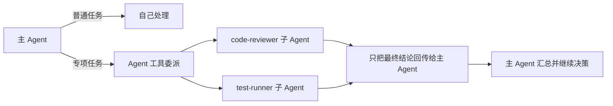

## 当前 Agent 的问题

第十四章之后，你的 agent 已经很强了：它有很多工具，也能接很多外部能力。但越强的单体 agent，越容易出现一个问题：所有事情都挤在同一个上下文里。

这会带来几个副作用：

- 一个复杂任务的中间探索会污染主上下文
- 多个子任务无法并行展开
- 不同子任务需要的提示词和工具边界完全不同，却都挤在一个 agent 里

这就是 Subagents 要解决的问题：拆分职责、隔离上下文、并行执行。

## 本章功能的作用

这一章会引入：

- `agents`
- `Agent` 工具
- 子 agent 的 `description`、`prompt` 和 `tools`

这章要解决的是复杂任务的组织方式问题。单体 agent 能力越强，越容易把所有探索、分析和工具调用都塞进同一个上下文里；Subagent 的价值，就是把这些职责拆开，让不同子任务在更清晰的边界里运行。

官方定义里，Subagent 不是“帮主 agent 调一个函数”，而是真正的新 agent 实例。它有自己的提示词、自己的工具集合、自己的回合上限和上下文窗口，所以它更像是一段可控的小型 автономic workflow，而不是一个普通 helper。

下面这张图能帮助你快速理解“委派”和“只回收最终结果”的边界：



## 具体使用方式

### 第一步：先确认主 agent 是否真的需要“委派”

只有当任务可以自然拆成多个子问题，而且这些子问题需要不同上下文或不同工具时，Subagent 才值得引入。否则它只会增加复杂度。

这一步的判断非常关键，因为 Subagent 不是越多越好。只有当拆分后的子任务确实能减少主上下文污染、提高专业化程度或者并行推进时，它才会带来净收益。

还要特别注意继承边界。官方文档明确说，子 agent 并不会自动拿到父对话历史；父 agent 真正传给它的主要是 `Agent` 工具调用时那一段 prompt，以及它自己可见的项目级上下文。这也是为什么委派 prompt 必须把需要的文件路径、错误信息和任务目标说清楚。

### 第二步：在主 agent 上开放 `Agent` 工具

子 agent 不会凭空出现。主 agent 只有拿到 `Agent` 这个工具，才具备把任务转交给子 agent 的能力。这是接入 Subagent 的第一道硬条件。

### 第三步：为每个子 agent 分别写 `description`、`prompt` 和 `tools`

`description` 决定主 agent 何时想到它，`prompt` 决定它以什么角色工作，`tools` 决定它能做什么。这三项要一起设计，不能只写一个名字就指望 Claude 自己补全。

### 第四步：故意把子 agent 的能力边界收紧

Subagent 的价值之一就是职责隔离。实际使用时，应尽量只给它完成该子任务所需的最小工具集合，而不是把主 agent 的所有能力都复制过去。

## 关键概念

### 1. Subagent 不是简单“函数调用”

它是一个新的 agent 实例，有自己的：

- system prompt
- 工具集合
- 上下文窗口

### 2. Subagent 最核心的价值

- 上下文隔离
- 并行化
- 专项角色化

### 3. 为什么 `description` 非常关键

Claude 是否会调用某个 subagent，很大程度上取决于你给它写的 `description` 是否足够明确。

## 可运行示例

这个示例创建两个子 agent：

- `code-reviewer`
- `test-runner`

把下面代码保存为 `chapter-15-subagents.ts`：

```ts
import { mkdtemp, writeFile, rm } from "node:fs/promises";
import { tmpdir } from "node:os";
import { join } from "node:path";
import { query } from "@anthropic-ai/claude-agent-sdk";

async function main() {
  const workspace = await mkdtemp(join(tmpdir(), "agent-sdk-ch15-"));

  try {
    await writeFile(
      join(workspace, "auth.ts"),
      [
        "export function getUserName(user?: { name?: string }) {",
        "  return user!.name!.toUpperCase();",
        "}",
        ""
      ].join("\n"),
      "utf8"
    );

    for await (const message of query({
      prompt: "Review auth.ts for crash risks and, if useful, delegate work to the available specialist agents.",
      options: {
        cwd: workspace,
        allowedTools: ["Read", "Grep", "Glob", "Agent"],
        permissionMode: "dontAsk",
        agents: {
          "code-reviewer": {
            description: "Use for code review, crash risk analysis, and maintainability review.",
            prompt: "Review code for bug risks, missing edge-case handling, and maintainability issues.",
            tools: ["Read", "Grep", "Glob"]
          },
          "test-runner": {
            description: "Use for test execution and failure analysis.",
            prompt: "Run tests when needed and explain failures clearly.",
            tools: ["Bash", "Read", "Grep"]
          }
        }
      }
    })) {
      if (message.type === "result") {
        console.log(message.result);
      }
    }
  } finally {
    await rm(workspace, { recursive: true, force: true });
  }
}

main().catch((error) => {
  console.error(error);
  process.exit(1);
});
```

运行：

```bash
npx tsx chapter-15-subagents.ts
```

## 示例拆解

### 第一步：先创建一个带明显风险的 `auth.ts`

这个文件的作用是给 `code-reviewer` 一个明确问题场景。只有输入足够具体，委派价值才会直观。

### 第二步：主 query 开放 `Agent` 工具并定义 `agents`

示例把两个子 agent 都注册在 `agents` 字段里。这里真正重要的不是数量，而是你可以看到每个子 agent 都有自己独立的描述、提示词和工具边界。

### 第三步：让主 prompt 明确允许委派

示例 prompt 中写了“if useful, delegate work to the available specialist agents”。这一步的功能是把“可以委派”从隐含能力变成显式允许，更利于学习者观察调用行为。

### 第四步：通过最终输出判断是否出现了专项分析风格

即使终端里不直接展示所有委派细节，最终结果如果明显更像结构化代码审查而不是泛泛说明，通常就说明子 agent 的角色化设计已经生效。

## 运行时你应该观察什么

- Claude 会根据任务判断是否要委派 `code-reviewer`
- 最终输出应更像专项审查，而不是泛泛而谈

## 易错点

- 主 agent 必须拥有 `Agent` 工具，否则无法调用 subagent。
- 不要把 `Agent` 再放进子 agent 的工具列表里；子 agent 不能继续嵌套 spawn。
- 子 agent 不会自动继承主对话历史，它收到的是你当前委派给它的任务上下文。

## 本章结束后你应该掌握

- 什么问题适合交给 subagent
- 如何用 `description` 提高委派命中率
- 为什么 subagent 是控制复杂度的重要手段

## 本章小结

到这里，你的 agent 已经不再是“单体万能助手”，而是开始具备“多角色、多上下文、多执行边界”的系统化结构。
