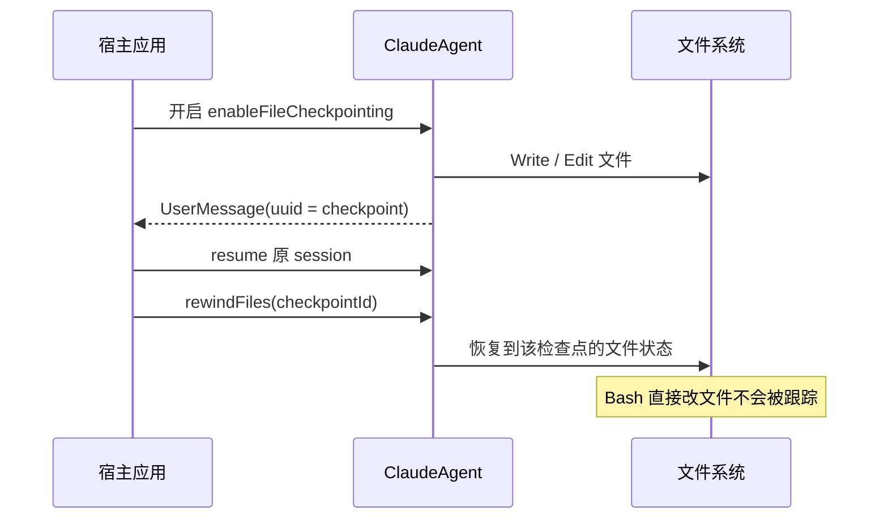

## 当前 Agent 的问题

第十六章之后，你已经能治理执行链，但一旦 Claude 真正开始改文件，就会出现一个新问题：如果它改错了，怎么撤销？

你当然可以靠 Git，但在很多场景里并不够细：

- 一次交互式实验里可能不想马上 commit
- 你想回到“本轮修改之前”，而不是某个仓库提交点
- 用户希望在会话级别一键撤销 agent 改动

这就是 checkpointing 要解决的问题：跟踪并回滚 agent 造成的文件变更。

## 本章功能的作用

这一章会引入：

- `enableFileCheckpointing`
- `extraArgs: { "replay-user-messages": null }`
- `rewindFiles()`

它补上的正是“自动修改之后怎么撤销”这一环。只要 agent 开始真实改文件，系统就必须有一种会话级别的回退能力，否则任何自动化改动都会显得不够可控。

官方文档还把它和 session 的差异说得非常明确：checkpointing 回滚的是磁盘文件状态，而不是会话历史。就算你把文件恢复了，Claude 仍然记得自己刚才做过哪些修改、读过哪些结果，这也是为什么它适合做“撤销改动”而不是“抹掉记忆”。

这章最适合先用一条时间线建立直觉：



## 具体使用方式

### 第一步：在 query 上打开 `enableFileCheckpointing`

这是文件回滚能力的总开关。只有开启它，SDK 才会跟踪 `Write`、`Edit`、`NotebookEdit` 等受支持工具带来的文件变化。

这一步可以理解成告诉 SDK：“从现在开始，请把受支持的文件改动当成可回放、可回滚的状态变化来记录。”没有这个记录过程，后面自然也就谈不上准确撤销。

还要记住它只覆盖 `Write`、`Edit` 和 `NotebookEdit`。如果 Claude 是通过 `Bash` 用 `echo > file`、`sed -i` 这类方式改了文件，这些变化官方明确说明不会进入 checkpoint 系统，因此也就无法用 `rewindFiles()` 恢复。

### 第二步：追加 `extraArgs: { "replay-user-messages": null }`

这一项的作用是让回放消息中带上可用于回滚的 `uuid`。如果缺了这一步，你通常能看到文件被改了，却拿不到之后要传给 `rewindFiles()` 的检查点 ID。

### 第三步：在消息流里记录 `checkpointId` 和 `sessionId`

回滚需要至少两个关键信号：一个是某个用户消息对应的 checkpoint UUID，另一个是后续继续调用时要恢复的会话 ID。这两者都应在第一次执行时就保存。

### 第四步：在后续 query 上调用 `rewindFiles()`

真正的回滚不是独立命令，而是挂在 query 对象上的方法。你通常会在恢复了原 session 的新 query 上调用 `rewindFiles(checkpointId)`，把文件状态倒回到指定点。

## 关键概念

### 1. Checkpointing 跟踪的是什么

它主要跟踪这些工具造成的文件改动：

- `Write`
- `Edit`
- `NotebookEdit`

### 2. 它不跟踪什么

通过 Bash 直接写文件的动作不会被它追踪。

### 3. 为什么需要 `replay-user-messages`

因为 checkpoint UUID 会出现在 user message 上。没有这个参数，你很难拿到可回滚的检查点 ID。

## 可运行示例

这个示例会：

1. 创建一个文件
2. 让 Claude 修改它
3. 记录 checkpoint
4. 再通过 `rewindFiles()` 回滚

把下面代码保存为 `chapter-17-checkpointing.ts`：

```ts
import { mkdtemp, writeFile, readFile, rm } from "node:fs/promises";
import { tmpdir } from "node:os";
import { join } from "node:path";
import { query } from "@anthropic-ai/claude-agent-sdk";

async function main() {
  const workspace = await mkdtemp(join(tmpdir(), "agent-sdk-ch17-"));

  try {
    await writeFile(join(workspace, "notes.md"), "- original note\n", "utf8");

    const opts = {
      cwd: workspace,
      enableFileCheckpointing: true,
      permissionMode: "acceptEdits" as const,
      allowedTools: ["Read", "Edit", "Write", "Glob"],
      extraArgs: { "replay-user-messages": null }
    };

    let checkpointId: string | undefined;
    let sessionId: string | undefined;

    const response = query({
      prompt: "Append two more markdown bullet points to notes.md.",
      options: opts
    });

    for await (const message of response) {
      if (message.type === "user" && message.uuid && !checkpointId) {
        checkpointId = message.uuid;
      }
      if ("session_id" in message && !sessionId) {
        sessionId = message.session_id;
      }
    }

    const edited = await readFile(join(workspace, "notes.md"), "utf8");
    console.log("After edit:\n");
    console.log(edited);

    if (checkpointId && sessionId) {
      const rewindQuery = query({
        prompt: "",
        options: { ...opts, resume: sessionId }
      });

      for await (const _message of rewindQuery) {
        await rewindQuery.rewindFiles(checkpointId);
        break;
      }
    }

    const restored = await readFile(join(workspace, "notes.md"), "utf8");
    console.log("\nAfter rewind:\n");
    console.log(restored);
  } finally {
    await rm(workspace, { recursive: true, force: true });
  }
}

main().catch((error) => {
  console.error(error);
  process.exit(1);
});
```

运行：

```bash
npx tsx chapter-17-checkpointing.ts
```

## 示例拆解

### 第一步：先让 Claude 对 `notes.md` 产生一次真实修改

如果没有发生文件编辑，就不存在可回滚状态。示例先通过一次写操作制造“前后状态差异”，便于观察 rewind 的效果。

### 第二步：在第一次 query 的消息流里捕获 `message.uuid`

代码在 `message.type === "user"` 且带有 `uuid` 时记录 `checkpointId`。这一点很关键，因为文件检查点并不出现在最终结果文本里，而是附着在消息级元数据上。

### 第三步：记录会话 ID 并重新发起一个恢复型 query

回滚动作不是在第一次 query 内完成，而是在后续恢复同一会话时执行。这正好也帮助读者理解：session 恢复和文件回滚是两套不同机制。

### 第四步：调用 `rewindFiles()` 后再次读取磁盘文件

示例最后重读 `notes.md`，目的是把回滚结果变成一个明确可观察的磁盘状态，而不是只依赖“看起来回滚成功了”的说明文字。

## 运行时你应该观察什么

- 第一次读取时，`notes.md` 被 Claude 追加了内容
- 回滚后，文件应恢复到最初只含一条 bullet 的状态

## 易错点

- 如果改动是通过 Bash 写入的，checkpointing 不一定能恢复。
- 如果没有记录 `checkpointId` 和 `sessionId`，之后就很难做精确回滚。

## 本章结束后你应该掌握

- 为什么 checkpointing 和 session 是两种不同层面的恢复能力
- 如何捕获 checkpoint UUID
- 怎样在后续调用里回滚文件

## 本章小结

到这里，你的 agent 已经具备“可撤销的文件修改能力”。这对任何允许 Claude 自动改代码的系统来说都非常关键。
