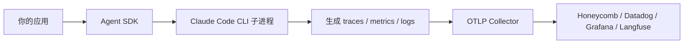

## 当前 Agent 的问题

第十八章之后，你已经知道单次 query 花了多少钱，但对于真正的生产系统来说，这还远远不够。

你还会关心：

- 哪一步最慢
- 哪个工具最常失败
- 哪个子 agent 花了最多时间
- 某一次异常执行在整条链路里发生在哪里

这时，单纯打印 `total_cost_usd` 已经不够了，你需要标准可观测能力。

## 本章功能的作用

这一章会引入通过 OpenTelemetry 导出：

- traces
- metrics
- logs

和上一章只看单次成本不同，这一章关注的是整条执行链的可观测性。真正进入生产后，你要知道的不只是“花了多少钱”，还包括“卡在哪一步”“哪个工具最慢”“哪个子任务最常失败”。

官方实现里，真正发出 OTel 的不是 SDK 本身，而是它拉起的 Claude Code CLI 子进程。SDK 的职责更像“把环境变量和上下文透传下去”，所以你配置 telemetry 时，本质上是在配置这个子进程的导出行为。

先把信号流向看清楚，会比死记环境变量更容易：



## 具体使用方式

### 第一步：先准备一个可接收 OTLP 的 collector

OpenTelemetry 不是只改几行 SDK 代码就能“自动看见图表”。你需要先有一个本地或远程 collector，能够接收 `otlp` 协议上报的数据。

这一步的意义在于把教程预期讲清楚。没有 collector，脚本也许仍然能正常跑完，但你看不到任何观测结果；问题不在 SDK，而在于接收端根本不存在。

另外还有一个很容易踩的坑：官方明确不建议在 SDK 场景里使用 `console` exporter，因为 SDK 正是通过标准输出通道传递消息流。把 telemetry 也打到 stdout，最容易把消息通道和日志通道搅在一起。

### 第二步：把遥测相关环境变量整理成单独对象

教程里最推荐的写法，是把 `CLAUDE_CODE_ENABLE_TELEMETRY`、`OTEL_EXPORTER_OTLP_ENDPOINT` 等变量集中放进 `otelEnv` 这类对象。这样配置项可读性更高，也更容易迁移到生产环境。

### 第三步：通过 `env: { ...process.env, ...otelEnv }` 合并传入

这里最重要的不是语法，而是“保留现有环境变量”。如果你直接用一个新对象覆盖环境，常见后果就是把 `PATH` 或 `ANTHROPIC_API_KEY` 一起弄丢。

### 第四步：把遥测观察和主流程结果分开验证

脚本本身仍然会像普通 query 一样返回结果；遥测是否成功，要到 collector 或可观测平台里去看。这是两个不同的验证面。

## 关键概念

### 1. 遥测不是 SDK 自己直接发的

Claude Agent SDK 底层会拉起 Claude Code CLI 子进程。真正发 OTel 数据的是这个 CLI 子进程，SDK 负责把配置透传给它。

### 2. TypeScript 里 `env` 会覆盖继承环境

这是一个非常重要的细节。你通常应该这样写：

```ts
env: { ...process.env, ...otelEnv }
```

否则你可能把 `PATH`、`ANTHROPIC_API_KEY` 等变量一起覆盖掉。

### 3. 本章示例的可运行前提

要真正看到遥测数据，你需要本机已有一个可接收 OTLP 的 collector。

如果你没有 collector，这个例子更适合拿来理解配置结构，而不是立即看到可视化结果。

## 可运行示例

假设你本地已经有一个 collector 监听 `http://localhost:4318`，把下面代码保存为 `chapter-19-otel.ts`：

```ts
import { query } from "@anthropic-ai/claude-agent-sdk";

const otelEnv = {
  CLAUDE_CODE_ENABLE_TELEMETRY: "1",
  CLAUDE_CODE_ENHANCED_TELEMETRY_BETA: "1",
  OTEL_TRACES_EXPORTER: "otlp",
  OTEL_METRICS_EXPORTER: "otlp",
  OTEL_LOGS_EXPORTER: "otlp",
  OTEL_EXPORTER_OTLP_PROTOCOL: "http/protobuf",
  OTEL_EXPORTER_OTLP_ENDPOINT: "http://localhost:4318"
};

async function main() {
  for await (const message of query({
    prompt: "List the main capabilities of the Claude Agent SDK in one paragraph.",
    options: {
      env: { ...process.env, ...otelEnv }
    }
  })) {
    if (message.type === "result") {
      console.log(message.result);
    }
  }
}

main().catch((error) => {
  console.error(error);
  process.exit(1);
});
```

运行：

```bash
npx tsx chapter-19-otel.ts
```

## 示例拆解

### 第一步：先定义 `otelEnv`

示例把所有关键遥测环境变量集中到一个对象中，作用是让读者一眼看清“要开哪些开关”和“数据往哪发”。

### 第二步：在 `query()` 里通过 `options.env` 透传配置

这一行演示的是 SDK 场景下的实际接法。Claude Agent SDK 会把这些环境变量传给底层 Claude Code CLI 子进程，由它完成 OTel 上报。

### 第三步：让 query 本身保持最小化

示例 prompt 很简单，目的是避免把问题复杂度和可观测配置混在一起。只要 collector 正常，哪怕是一个最简单的 query，也足够产生 trace 和日志信号。

### 第四步：分别检查终端输出和后端遥测

终端里看到的 `message.result` 只能说明 query 成功；真正的 OTel 验证要去 collector 或可观测平台中确认 interaction、tool、llm_request 等信号是否出现。

## 运行时你应该观察什么

- 这段脚本本身和普通 query 一样工作
- 如果 collector 已就绪，你应该能在后端里看到 interaction / tool / llm_request 相关信号

## 易错点

- 不要在 SDK 场景里使用 `console` exporter，它会和消息通道冲突。
- 如果 collector 不可用，遥测可能会丢失或报错，但不一定影响 query 主流程。

## 本章结束后你应该掌握

- OpenTelemetry 在 Agent SDK 中是如何接入的
- 为什么 traces、metrics、logs 都值得保留
- TypeScript 里环境变量合并为什么必须谨慎

## 本章小结

到这里，你的 agent 已经进入真正可运营阶段：不仅知道结果是什么，还能知道过程发生了什么。
