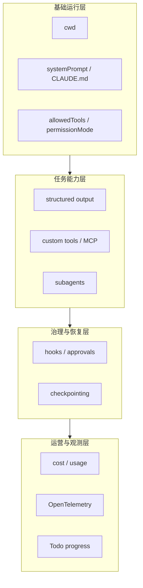

## 当前 Agent 的问题

到了这一章之前，你已经分别学过：

- 最小 agent
- session
- streaming input/output
- approvals
- structured output
- CLAUDE.md
- skills / commands / plugins
- custom tools / MCP / tool search
- subagents
- hooks
- checkpointing
- cost / telemetry / todos

但单独理解每个能力，不等于知道它们如何在一个真实系统里拼起来。

最后一个问题就是：一套“可落地的 agent 骨架”到底应该长什么样？

## 本章功能的作用

这一章不是再引入新 API，而是把前面已经学过的能力装配成一个完整示例，回答两个问题：

1. 哪些能力应该同时出现？
2. 哪些能力是可选的增强层，而不是必须项？

它的重点不在于“把所有配置都堆在一起”，而在于帮助你建立一套分层视角。一个完整 agent 往往同时包含基础运行层、任务能力层、治理层和观测层。如果没有这种分层意识，配置一多就会迅速失控，最后只剩下一大坨看似能跑、实际很难维护的参数集合。

这一章也刻意不把每一种可选能力都塞到同一个本地示例里。例如 telemetry、远程 MCP、真正的人类审批 UI 都需要外部基础设施。教程保留的是一套“本地可跑的最小全功能骨架”，然后再明确告诉你哪些层在生产环境里还要额外接出系统边界。

整章最适合先用这张分层图建立总览：



## 具体使用方式

### 第一步：先搭一个可稳定复用的基础层

完整 agent 的第一层通常包括 `cwd`、`allowedTools`、`permissionMode`、`systemPrompt` 和项目级 `CLAUDE.md`。这部分决定 agent 的默认工作方式和基本行为边界。

这一层最好先独立稳定下来，再继续往上叠能力。因为如果连工作目录、默认提示词和基础权限边界都还没定住，后面再接自定义工具、Subagent、Hook 时，很难判断问题到底出在哪一层。

例如 `cwd`、`systemPrompt`、`settingSources`、`allowedTools` 其实就是骨架层最关键的四个点。`cwd` 决定观察范围，`systemPrompt` 和 `CLAUDE.md` 决定行为基线，`allowedTools` 决定能力边界。只有这层是稳定的，后面的能力叠加才有意义。

### 第二步：再把任务能力层按模块挂上

真正让 agent 有业务价值的部分，通常来自结构化输出、自定义工具、MCP server、subagent 等能力。它们不应该混成一团，而应该按“结果输出”“业务工具”“角色分工”这样的职责分别接入。

这种拆法会直接影响后续可维护性。比如结构化输出决定结果契约，自定义工具决定业务能力入口，Subagent 决定复杂任务如何拆分。如果你在设计时没有把这些层次分开，后面任何一个点要扩展，都会牵动整套系统。

### 第三步：把治理层和恢复层单独加上

Hook、审批、checkpointing 这类能力不直接提升回答内容，但它们决定 agent 是否可控、是否可撤销、是否适合放进真实系统。这一层在工程上必须单独看待。

这类能力经常被低估，因为它们不会让示例看起来更“聪明”。但一旦系统开始真实改文件、跑命令、调外部工具，这一层反而会比回答质量更重要。可控、可回滚，往往是系统能否上线的先决条件。

官方各章节其实都在强调同一个工程原则：模型的聪明程度只是系统的一部分，真正让它可上线的是治理链。Hook、审批、checkpointing、权限模式看起来都不“酷”，但它们决定了你是否敢让 agent 真的接触真实代码和真实环境。

### 第四步：最后补上成本和观测层

`total_cost_usd`、usage、OpenTelemetry、Todo 跟踪都属于“让系统可运营、可解释”的层。它们通常不是最先写出来的代码，但在长期运行里非常重要。

很多 demo 到这里就停了，只关注“任务做成了没有”。但在真实环境里，你还要知道它花了多少钱、哪一步最慢、用户现在能不能看懂系统进度。这些问题都属于运营层，而不是算法层。

## 设计原则

为了兼顾“完整性”和“可运行性”，这个示例分为两层：

- 核心可运行层：本地就能跑
- 可选增强层：例如 telemetry，需要额外基础设施

## 可运行示例

下面这个脚本会组合这些能力：

- `claude_code` preset prompt
- `CLAUDE.md`
- 流式输出
- 结构化输出
- 自定义工具
- subagent
- hook
- checkpointing
- 成本读取

把下面代码保存为 `chapter-21-integrated-agent.ts`：

```ts
import { mkdtemp, mkdir, writeFile, readFile, rm } from "node:fs/promises";
import { tmpdir } from "node:os";
import { join } from "node:path";
import { query, tool, createSdkMcpServer, type HookCallback, type PreToolUseHookInput } from "@anthropic-ai/claude-agent-sdk";
import { z } from "zod";

const lookupPolicy = tool(
  "lookup_policy",
  "Look up a short internal engineering policy summary by keyword",
  {
    keyword: z.string()
  },
  async ({ keyword }) => ({
    content: [{ type: "text", text: `Policy summary for "${keyword}": prefer safe, incremental changes.` }]
  })
);

const policyServer = createSdkMcpServer({
  name: "policy",
  version: "1.0.0",
  tools: [lookupPolicy]
});

const safeWriteHook: HookCallback = async (input) => {
  const preInput = input as PreToolUseHookInput;
  const toolInput = preInput.tool_input as Record<string, unknown>;
  const filePath = String(toolInput.file_path ?? "");

  if (filePath.endsWith(".env")) {
    return {
      hookSpecificOutput: {
        hookEventName: preInput.hook_event_name,
        permissionDecision: "deny",
        permissionDecisionReason: "Integrated demo does not allow editing .env files."
      }
    };
  }

  return {};
};

const outputSchema = {
  type: "object",
  properties: {
    summary: { type: "string" },
    changed_files: {
      type: "array",
      items: { type: "string" }
    },
    next_actions: {
      type: "array",
      items: { type: "string" }
    }
  },
  required: ["summary", "changed_files", "next_actions"]
};

async function main() {
  const workspace = await mkdtemp(join(tmpdir(), "agent-sdk-ch21-"));

  try {
    await mkdir(join(workspace, "src"), { recursive: true });

    await writeFile(
      join(workspace, "CLAUDE.md"),
      [
        "# Project Rules",
        "",
        "- Prefer small focused edits",
        "- Explain user-facing changes clearly",
        "- Keep examples concise",
        ""
      ].join("\n"),
      "utf8"
    );

    await writeFile(
      join(workspace, "src", "auth.ts"),
      [
        "export function getUserName(user?: { name?: string }) {",
        "  return user!.name!.toUpperCase();",
        "}",
        ""
      ].join("\n"),
      "utf8"
    );

    for await (const message of query({
      prompt: "Review src/auth.ts, use the policy tool if helpful, fix the crash risk, and return a structured summary.",
      options: {
        cwd: workspace,
        systemPrompt: {
          type: "preset",
          preset: "claude_code",
          append: "Prefer concise engineering-style output."
        },
        settingSources: ["project"],
        includePartialMessages: true,
        outputFormat: {
          type: "json_schema",
          schema: outputSchema
        },
        enableFileCheckpointing: true,
        allowedTools: [
          "Read",
          "Edit",
          "Write",
          "Glob",
          "Grep",
          "Agent",
          "mcp__policy__lookup_policy"
        ],
        permissionMode: "acceptEdits",
        mcpServers: {
          policy: policyServer
        },
        agents: {
          reviewer: {
            description: "Use for code review and crash risk analysis.",
            prompt: "Review code for correctness, crash risk, and maintainability.",
            tools: ["Read", "Glob", "Grep"]
          }
        },
        hooks: {
          PreToolUse: [{ matcher: "Write|Edit", hooks: [safeWriteHook] }]
        }
      }
    })) {
      if (message.type === "stream_event") {
        const event = message.event;
        if (event.type === "content_block_delta" && event.delta.type === "text_delta") {
          process.stdout.write(event.delta.text);
        }
      }

      if (message.type === "result") {
        console.log("\n\nStructured output:\n");
        console.dir(message.structured_output, { depth: null });
        console.log("\nEstimated cost:", message.total_cost_usd);
        console.log("Session ID:", message.session_id);
      }
    }

    const finalCode = await readFile(join(workspace, "src", "auth.ts"), "utf8");
    console.log("\nUpdated src/auth.ts:\n");
    console.log(finalCode);
  } finally {
    await rm(workspace, { recursive: true, force: true });
  }
}

main().catch((error) => {
  console.error(error);
  process.exit(1);
});
```

前置依赖：

```bash
npm install zod
```

运行：

```bash
npx tsx chapter-21-integrated-agent.ts
```

## 示例拆解

### 第一步：先构造项目规则和有缺陷的代码样本

示例写入 `CLAUDE.md` 和一个存在崩溃风险的 `src/auth.ts`。这一步的功能是同时准备“行为规则来源”和“需要被修复的真实目标”。

### 第二步：定义一把业务工具和一条运行时 Hook

`lookup_policy` 代表自定义业务工具，`safeWriteHook` 代表执行治理逻辑。两者合在一起，正好体现完整 agent 不只是“能做事”，还要“按规则做事”。

### 第三步：在一次 `query()` 里把关键能力全部装配起来

示例同时接入 `systemPrompt`、`settingSources`、`outputFormat`、`enableFileCheckpointing`、`mcpServers`、`agents`、`hooks`。这一块最重要的学习点，不是记参数，而是理解这些配置各自属于哪一层职责。

如果你把这一段只看成“一个大 options 对象”，收获其实会很有限。更好的读法是把它按层拆开看：哪些配置负责行为基线，哪些负责能力扩展，哪些负责治理，哪些负责恢复和观测。这样以后你自己组装 agent 时，就知道应该先搭哪一层、再补哪一层。

### 第四步：分别从流式输出、结构化结果、成本和文件结果四个面验证系统

终端中的流式文本证明实时输出在工作，`structured_output` 证明结果契约在工作，`total_cost_usd` 证明成本统计在工作，最后读取 `src/auth.ts` 则证明实际文件修改也已经完成。

这种多视角验证方式很接近真实集成测试。因为一个完整 agent 成功与否，不能只看“Claude 说自己改好了没有”，还要看流式体验、结构化结果、真实文件状态、成本信号是否同时符合预期。

## 运行时你应该观察什么

- 终端中会出现实时流式文本
- Claude 会修改 `src/auth.ts`
- 最终你会拿到结构化结果对象
- 同时还能拿到 `session_id` 和 `total_cost_usd`

## 这个示例还没有默认打开什么

为了保证本地可运行，它没有默认开启需要外部基础设施的能力，例如：

- OTel collector
- 远程 MCP server
- 人工审批 UI

这些能力在前几章已经讲过，接入时只需要把对应配置块补上。

## 你现在已经可以做什么

学完这一章后，你应该已经能从零搭起一个：

- 可读写代码
- 可持续会话
- 可流式交互
- 可扩展工具
- 可治理执行
- 可回滚修改
- 可输出结构化结果
- 可统计成本

的 agent runtime。

## 本章小结

到这里，这套学习路径的目标就完成了。你得到的不再是一个“会回答问题的模型调用示例”，而是一套可以真正嵌入工程系统的 agent 运行骨架。
