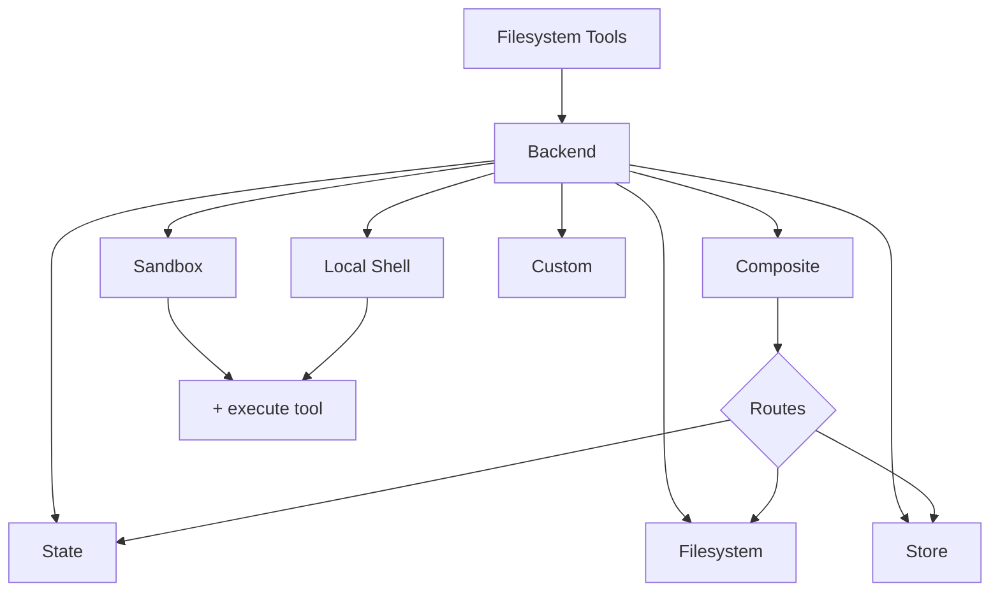

很多人第一次看到 Deep Agents 的文件工具，会默认认为它们直接连着本地磁盘。真正支撑这一切的，其实是 backend 抽象层：同样的 `read_file`、`write_file`、`glob`，可以落到内存状态、真实文件系统、持久化 store，甚至是隔离沙箱里。把这一层想明白之后，很多看似分散的能力才会重新连成一张图。

## 为什么值得关注

后端决定的从来不只是“文件存在哪”。它同时决定数据会不会持久化、会不会跨线程共享、Agent 有没有机会碰到真实磁盘，以及是否还能顺带执行 shell 命令。也正因为如此，backend 设计其实就是在给 Agent 设定执行环境和存储边界。

一个合适的后端组合，通常要同时支撑这些动作：

- 浏览目录
- 读取文件
- 写入文件
- 编辑文件
- 搜索文件名
- 搜索文件内容
- 在特定后端中持久化中间结果或长期数据
- 在需要时执行 shell 命令

后端决定的不只是“文件存在哪”，还决定了：

- 数据是否持久化
- 数据是否跨线程共享
- Agent 是否会接触真实磁盘
- Agent 是否能执行命令
- 是否具备安全隔离
- 是否支持多存储源混合挂载

---

## 后端是什么

Deep Agents 会通过一组文件系统工具暴露文件操作能力，例如：

- `ls`
- `read_file`
- `write_file`
- `edit_file`
- `glob`
- `grep`

这些工具本身并不直接操作磁盘或远程存储，而是统一通过 backend 去完成。

可以把 backend 理解为 Agent 文件系统能力的“底层适配层”。

它负责回答这些问题：

- `/docs/a.md` 这个路径到底对应哪里
- 写文件时应该写进内存、磁盘、数据库还是对象存储
- 搜索操作应如何执行
- 某些路径是否允许写入
- 某些目录应该路由到不同存储

---

## 一个整体理解框架

可以把后端分成 5 类：

- 临时型：只在当前线程里存在
- 本地型：直接读写本地磁盘
- 持久型：跨线程长期存储
- 可执行型：除了文件还允许执行 shell 命令
- 路由型：不同路径映射到不同后端

如果是图片文件，例如：

- `.png`
- `.jpg`
- `.jpeg`
- `.gif`
- `.webp`

那么 `read_file` 可以直接返回多模态内容，这在所有后端上都成立。

---

## 后端关系图



这张图可以帮助你快速建立整体认知：

- 文件系统工具并不直接操作存储，而是统一经过 backend
- `CompositeBackend` 负责把不同路径继续路由到不同 backend
- `Sandbox` 和 `LocalShellBackend` 比普通文件后端多出 `execute` 能力
- 自定义 backend 的本质也是接到这条统一抽象层上

---

## 快速选型

真正开始选 backend 时，最常见的困惑通常不是“不知道有哪些选项”，而是不知道该先按什么维度判断。一个实用的办法是先别从实现细节入手，而是先问：你的文件是临时 scratch pad、真实项目文件、长期记忆，还是需要顺带执行命令？沿着这个问题往下看，后面的选型会清楚很多。

### `StateBackend`

适合：

- 默认起步
- 临时中间结果
- 单线程 Agent scratch pad
- 不需要长期持久化的数据

特点：

- 存在 LangGraph state 中
- 生命周期通常跟 thread 绑定
- 对本地机器没有真实副作用

### `FilesystemBackend`

适合：

- 本地项目目录
- 开发环境文件处理
- CI 中操作挂载目录

特点：

- 直接读写真实磁盘
- 有真实副作用
- 必须认真考虑访问范围和安全限制

### `StoreBackend`

适合：

- 跨线程持久化
- 长期记忆
- 多轮任务共享数据
- 多用户长期状态存储

特点：

- 依赖 LangGraph store
- 天然适合长期保存
- 需要 namespace 隔离策略

### `LocalShellBackend`

适合：

- 本地 coding assistant
- 本地自动化脚本助手
- 明确受控的开发环境

特点：

- 除了文件能力，还能执行 shell
- 风险极高
- 不适合生产环境或不可信输入

### `CompositeBackend`

适合：

- 不同目录使用不同存储
- 临时文件和长期记忆分开
- 把多个来源统一挂载成一个文件系统视图

特点：

- 灵活性最高
- 最适合复杂 Agent 系统

---

## `StateBackend`

`StateBackend` 是默认后端。

如果创建 Agent 时不传 backend，底层就是使用它。

```python
from deepagents import create_deep_agent
from deepagents.backends import StateBackend

agent = create_deep_agent(
    model="google_genai:gemini-3.1-pro-preview",
    backend=StateBackend()
)
```

### 它的工作方式

- 文件数据保存在 LangGraph agent state 中
- 能在同一个 thread 的多轮执行里继续存在
- 可以通过 checkpoint 保留线程内状态

### 适合的用途

- 存放中间结果
- 存放研究过程中的临时材料
- 把大段工具输出先写入再分段读取
- 让 supervisor agent 和 subagent 共用临时文件区

### 一个容易忽略的点

`StateBackend` 是 supervisor 和 subagent 共享的。

这意味着：

- 子代理写入的文件不会在它结束后自动消失
- 主代理和其他子代理仍然可以继续读取这些文件

这非常适合做：

- 子任务结果共享
- 分阶段材料沉淀
- 临时上下文中转

### 使用建议

如果你还不确定该用什么 backend，就先从 `StateBackend` 开始。

---

## `FilesystemBackend`

`FilesystemBackend` 直接读写真实文件系统。

```python
from deepagents.backends import FilesystemBackend
from deepagents import create_deep_agent

agent = create_deep_agent(
    model="google_genai:gemini-3.1-pro-preview",
    backend=FilesystemBackend(root_dir=".", virtual_mode=True)
)
```

### 它的工作方式

- 把一个根目录暴露给 Agent
- Agent 对文件的读写都发生在真实磁盘上
- `root_dir` 定义了工作根路径

### `root_dir` 的意义

`root_dir` 决定 Agent 的主要工作目录。

如果你希望 Agent 只接触某个项目目录，应该显式指定这个目录。

注意：

- 用绝对路径更清晰
- 对安全边界更可控

### `virtual_mode=True` 为什么重要

这是最关键的安全配置之一。

开启后：

- 路径会在 `root_dir` 下被规范化
- 可阻止类似 `..`、`~`、越出根目录的路径逃逸
- 能基于路径限制访问范围

如果不开启：

- 即使设置了 `root_dir`
- 也不意味着真的形成了安全沙箱

可以把这个规则记死：

- 使用 `FilesystemBackend` 时，几乎总是应该配 `virtual_mode=True`

### 适合的场景

- 本地开发助手
- 对代码仓库做读写修改
- CI 沙箱中的项目目录
- 挂载卷目录

### 不适合的场景

- 公网 API 服务
- 多租户系统
- 处理不可信用户输入的生产环境

### 风险

一旦给 Agent 真实文件访问能力，就意味着它可能：

- 读取 `.env`
- 读取密钥和凭证
- 修改真实文件
- 配合网络工具把敏感信息外传
- 造成永久性文件变更

### 推荐防护措施

- 对高风险操作加人工审批
- 把 secrets 放在 Agent 不可访问路径之外
- 在生产里优先用 sandbox
- 只暴露最小必要目录

---

## `LocalShellBackend`

`LocalShellBackend` 在 `FilesystemBackend` 基础上增加了 `execute` 工具，可以直接执行 shell 命令。

```python
from deepagents.backends import LocalShellBackend
from deepagents import create_deep_agent

agent = create_deep_agent(
    model="google_genai:gemini-3.1-pro-preview",
    backend=LocalShellBackend(root_dir=".", env={"PATH": "/usr/bin:/bin"})
)
```

### 它的工作方式

- 具备文件读写能力
- 同时具备 shell 执行能力
- 命令直接在宿主机执行
- 工作目录以 `root_dir` 为起点
- 但 shell 本身依然可能访问系统上其他路径

### 重要认知

只要给了 shell，`virtual_mode=True` 就不再构成真正安全边界。

原因很简单：

- 即使文件工具受路径限制
- shell 命令仍然可能直接访问系统任意可访问路径

### 适合的场景

- 本地开发环境
- 可信环境下的 coding assistant
- 个人机器上的自动化助手
- 受控 CI 流程

### 绝对不适合的场景

- 生产环境
- 多租户平台
- 不可信输入场景
- 让普通终端用户直接驱动命令执行的系统

### 风险等级为什么更高

有了 shell 之后，Agent 理论上可以：

- 运行任意命令
- 读取任何可访问文件
- 改动系统文件
- 消耗 CPU、内存、磁盘
- 执行不可逆操作

### 推荐防护措施

- 强烈建议加人工审批
- 只在专用开发环境使用
- 不要在共享主机使用
- 生产环境需要 shell 时优先用 sandbox

### 常用参数理解

- `timeout`
  - 命令最长执行时间
  - 默认一般为 120 秒

- `max_output_bytes`
  - 限制输出大小
  - 防止命令输出无限膨胀

- `env`
  - 明确指定环境变量

- `inherit_env`
  - 是否继承宿主环境变量

在安全敏感场景下，环境变量暴露也是风险点。

---

## `StoreBackend`

`StoreBackend` 用于跨线程持久化存储。

```python
from langgraph.store.memory import InMemoryStore
from deepagents.backends import StoreBackend
from deepagents import create_deep_agent

agent = create_deep_agent(
    model="google_genai:gemini-3.1-pro-preview",
    backend=StoreBackend(
        namespace=lambda rt: (rt.runtime.context.user_id,),
    ),
    store=InMemoryStore()
)
```

### 它的工作方式

- 文件不放在线程内 state 中
- 而是放在 LangGraph 的 store 中
- 数据可以跨线程继续存在

### 适合的用途

- 长期记忆
- 用户级持久资料
- 多轮执行共享文件
- 部署环境中的稳定存储层

### 为什么 `StoreBackend` 很重要

很多 Agent 场景并不是“一轮执行完就结束”，而是：

- 用户今天问一次
- 明天继续接着问
- 不同线程还希望读取同一份材料

这时 `StateBackend` 就不够了，必须使用 `StoreBackend`。

---

## namespace 的作用

`StoreBackend` 的核心不是“能存”，而是“怎么隔离”。

它通过 `namespace` 决定数据读写在哪个命名空间下。

本质上，namespace 决定了：

- 谁能看到这份数据
- 哪些执行共享同一批文件
- 不同用户的数据是否会串

### 一个关键原则

多用户场景下，namespace 绝不能偷懒。

如果 namespace 设计不当，可能导致：

- 用户 A 读到用户 B 的文件
- 多租户数据交叉污染
- 长期记忆串用

### 常见 namespace 设计方式

#### 按用户隔离

```python
backend = StoreBackend(
    namespace=lambda rt: (rt.server_info.user.identity,),
)
```

适合：

- 每个用户独立记忆
- 每个用户独立文件空间

#### 按 assistant 隔离

```python
backend = StoreBackend(
    namespace=lambda rt: (rt.server_info.assistant_id,),
)
```

适合：

- 同一个 assistant 的所有用户共享一组资料

#### 按 thread 隔离

```python
backend = StoreBackend(
    namespace=lambda rt: (rt.execution_info.thread_id,),
)
```

适合：

- 单会话独立存储
- 每段对话彼此隔离

#### 组合隔离

例如：

- `(user_id, thread_id)`
- `(tenant_id, assistant_id)`
- `(user_id, "filesystem")`

适合：

- 更细粒度的数据范围控制

### namespace 设计建议

多用户生产场景默认原则：

- 明确指定 namespace
- 不使用模糊默认值
- 把 user_id 或 tenant_id 纳入 namespace

---

## `CompositeBackend`

当单一 backend 开始不够用时，通常不是因为某个后端本身有问题，而是因为你的系统已经同时存在“临时材料”“长期记忆”“真实工作区”这几种完全不同的存储诉求。`CompositeBackend` 的价值，就是把这些差异整合成一个统一文件系统视图，而不是让 Agent 自己理解多个分裂存储。

`CompositeBackend` 用于把不同路径前缀路由到不同后端。

```python
from deepagents import create_deep_agent
from deepagents.backends import CompositeBackend, StateBackend, StoreBackend
from langgraph.store.memory import InMemoryStore

agent = create_deep_agent(
    model="google_genai:gemini-3.1-pro-preview",
    backend=CompositeBackend(
        default=StateBackend(),
        routes={
            "/memories/": StoreBackend(),
        }
    ),
    store=InMemoryStore()
)
```

### 它的工作方式

- 先看文件路径前缀
- 决定该路径应该交给哪个 backend 处理
- 默认路径交给 `default`
- 特定路径前缀交给 `routes` 中定义的 backend

### 一个典型例子

```python
from deepagents import create_deep_agent
from deepagents.backends import CompositeBackend, StateBackend, FilesystemBackend

agent = create_deep_agent(
    model="google_genai:gemini-3.1-pro-preview",
    backend=CompositeBackend(
        default=StateBackend(),
        routes={
            "/memories/": FilesystemBackend(root_dir="/deepagents/myagent", virtual_mode=True),
        },
    )
)
```

此时：

- `/workspace/plan.md` → `StateBackend`
- `/memories/agent.md` → `FilesystemBackend`

### 它最适合什么

最常见的用法是：

- 普通工作区走临时状态存储
- 长期记忆目录走持久存储

例如：

- `/workspace/` 存临时草稿
- `/memories/` 存长期记忆
- `/docs/` 挂远程文档库

### 路由规则注意点

- 路径前缀更长的规则优先级更高
- 结果展示时仍保留原始路径前缀
- `ls`、`glob`、`grep` 会聚合多后端结果

这使得 Agent 看到的是一个统一文件系统视图，而不是多个割裂系统。

---

## 如何指定 backend

最直接的方法就是在 `create_deep_agent(...)` 里传入：

```python
agent = create_deep_agent(
    model="google_genai:gemini-3.1-pro-preview",
    backend=StateBackend()
)
```

如果不传：

- 默认使用 `StateBackend()`

因此可以理解为：

- 默认是线程内临时文件系统
- 需要持久化、本地磁盘或命令执行时，再主动切换 backend

---

## 自定义虚拟文件系统

再往前走一步，你会发现 backend 真正厉害的地方，不在于框架内置了多少种实现，而在于它把“文件系统”抽象成了一层稳定接口。只要你的外部存储能被映射成路径和内容，理论上就可以让 Agent 继续用同一种文件心智去操作它。

如果内置后端不够，你可以实现自己的 backend，把远程存储或数据库映射成文件系统。

适合的外部存储包括：

- S3
- Postgres
- 对象存储
- 内部文档库
- 任意可抽象成“路径 -> 内容”的系统

### 自定义 backend 的设计目标

核心目标是让 Agent 仍然用统一文件系统心智去工作：

- 路径是绝对路径，如 `/docs/a.md`
- Agent 不需要知道底层到底是磁盘、数据库还是对象存储

### 自定义实现时要考虑什么

- 路径如何映射到底层 key 或 row
- `ls` 和 `glob` 是否能高效实现
- `grep` 是否能尽量在服务端过滤
- 写入是否返回正确结果结构
- 出错时返回结构化 error，而不是直接抛异常

### S3 风格示例骨架

```python
from deepagents.backends.protocol import (
    BackendProtocol, WriteResult, EditResult, LsResult, ReadResult, GrepResult, GlobResult,
)

class S3Backend(BackendProtocol):
    def __init__(self, bucket: str, prefix: str = ""):
        self.bucket = bucket
        self.prefix = prefix.rstrip("/")

    def _key(self, path: str) -> str:
        return f"{self.prefix}{path}"

    def ls(self, path: str) -> LsResult:
        ...

    def read(self, file_path: str, offset: int = 0, limit: int = 2000) -> ReadResult:
        ...

    def grep(self, pattern: str, path: str | None = None, glob: str | None = None) -> GrepResult:
        ...

    def glob(self, pattern: str, path: str = "/") -> GlobResult:
        ...

    def write(self, file_path: str, content: str) -> WriteResult:
        ...

    def edit(self, file_path: str, old_string: str, new_string: str, replace_all: bool = False) -> EditResult:
        ...
```

### Postgres 风格思路

如果用数据库实现，可以设计一张 `files` 表：

- `path`
- `content`
- `created_at`
- `modified_at`

然后把：

- `ls` 映射成路径范围查询
- `glob` 映射成 SQL 过滤或应用层过滤
- `grep` 映射成候选集扫描
- `read/write/edit` 映射成标准 CRUD

### 一个关键约束

对于外部持久化后端，例如：

- S3
- Postgres
- 远程对象存储

写入结果通常应返回 `files_update=None`。

因为只有纯状态型后端才需要通过 state update 机制回写文件更新。

---

## 权限控制

权限用于在 backend 被调用之前，先声明性地决定哪些路径允许读写。

也就是说，权限系统是 Agent 文件系统访问的第一道门。

### 示例

```python
from deepagents import create_deep_agent, FilesystemPermission
from deepagents.backends import CompositeBackend, StateBackend, StoreBackend

agent = create_deep_agent(
    model="google_genai:gemini-3.1-pro-preview",
    backend=CompositeBackend(
        default=StateBackend(),
        routes={
            "/memories/": StoreBackend(
                namespace=lambda rt: (rt.server_info.user.identity,),
            ),
            "/policies/": StoreBackend(
                namespace=lambda rt: (rt.context.org_id,),
            ),
        },
    ),
    permissions=[
        FilesystemPermission(
            operations=["write"],
            paths=["/policies/**"],
            mode="deny",
        ),
    ],
)
```

### 这个例子在表达什么

- `/policies/**` 目录下的文件禁止写入
- 即使底层 backend 能写，这条规则也会先挡住

### 权限适合控制什么

- 某些目录只读
- 某些目录禁止编辑
- 某些路径只有 supervisor 可写
- 某些路径对子代理不可见

### 一条实用原则

优先把“能否访问”这类规则放在 permissions 层；  
把“访问时还要做什么附加检查”放在 backend 包装层。

---

## 增加策略钩子

如果路径 allow/deny 还不够，可以在 backend 外面再包一层策略逻辑。

适合的场景包括：

- 内容审查
- 审计日志
- 写入频率限制
- 某些目录的特殊校验
- 企业级规则封装

### 方式 1：直接继承 backend

```python
from deepagents.backends.filesystem import FilesystemBackend
from deepagents.backends.protocol import WriteResult, EditResult

class GuardedBackend(FilesystemBackend):
    def __init__(self, *, deny_prefixes: list[str], **kwargs):
        super().__init__(**kwargs)
        self.deny_prefixes = [p if p.endswith("/") else p + "/" for p in deny_prefixes]

    def write(self, file_path: str, content: str) -> WriteResult:
        if any(file_path.startswith(p) for p in self.deny_prefixes):
            return WriteResult(error=f"Writes are not allowed under {file_path}")
        return super().write(file_path, content)

    def edit(self, file_path: str, old_string: str, new_string: str, replace_all: bool = False) -> EditResult:
        if any(file_path.startswith(p) for p in self.deny_prefixes):
            return EditResult(error=f"Edits are not allowed under {file_path}")
        return super().edit(file_path, old_string, new_string, replace_all)
```

### 方式 2：包装任意 backend

```python
from deepagents.backends.protocol import (
    BackendProtocol, WriteResult, EditResult, LsResult, ReadResult, GrepResult, GlobResult,
)

class PolicyWrapper(BackendProtocol):
    def __init__(self, inner: BackendProtocol, deny_prefixes: list[str] | None = None):
        self.inner = inner
        self.deny_prefixes = [p if p.endswith("/") else p + "/" for p in (deny_prefixes or [])]

    def _deny(self, path: str) -> bool:
        return any(path.startswith(p) for p in self.deny_prefixes)

    def ls(self, path: str) -> LsResult:
        return self.inner.ls(path)

    def read(self, file_path: str, offset: int = 0, limit: int = 2000) -> ReadResult:
        return self.inner.read(file_path, offset=offset, limit=limit)

    def grep(self, pattern: str, path: str | None = None, glob: str | None = None) -> GrepResult:
        return self.inner.grep(pattern, path, glob)

    def glob(self, pattern: str, path: str = "/") -> GlobResult:
        return self.inner.glob(pattern, path)

    def write(self, file_path: str, content: str) -> WriteResult:
        if self._deny(file_path):
            return WriteResult(error=f"Writes are not allowed under {file_path}")
        return self.inner.write(file_path, content)

    def edit(self, file_path: str, old_string: str, new_string: str, replace_all: bool = False) -> EditResult:
        if self._deny(file_path):
            return EditResult(error=f"Edits are not allowed under {file_path}")
        return self.inner.edit(file_path, old_string, new_string, replace_all)
```

### 什么时候用 wrapper 而不是 subclass

如果你希望同一套策略能作用于：

- `FilesystemBackend`
- `StoreBackend`
- 自定义 backend
- `CompositeBackend`

那优先用 wrapper，会更通用。

---

## 沙箱的定位

沙箱本质上也是后端的一种，只不过它额外提供 `execute` 能力，并且运行在隔离环境中。

可以把它看成：

- 比 `LocalShellBackend` 更安全的执行方案
- 比本地磁盘后端更适合生产的文件与命令执行环境

适合场景：

- 自动生成代码
- 安装依赖
- 跑测试
- 编译项目
- 执行不应污染本机的任务

一个简单判断标准：

- 如果你需要执行命令，但又不希望宿主机直接暴露给 Agent，就用 sandbox

---

## 迁移方式：不要再用 backend factory

旧写法里，backend 可能通过工厂函数构造。

例如以前会这样写：

```python
backend=lambda rt: StateBackend(rt)
```

现在推荐直接传实例：

```python
backend=StateBackend()
```

### 为什么发生这个变化

新版 backend 已经能自己通过 LangGraph 提供的运行时助手拿到所需上下文，不再需要你手动把 runtime 传进去。

### 旧写法与新写法对照

#### 旧写法

```python
backend=lambda rt: CompositeBackend(
    default=StateBackend(rt),
    routes={"/memories/": StoreBackend(rt)},
)
```

#### 新写法

```python
backend=CompositeBackend(
    default=StateBackend(),
    routes={"/memories/": StoreBackend()},
)
```

### 迁移建议

如果你的代码里还在：

- 给 `backend=` 传 callable
- 给 `StateBackend(runtime)` 传 runtime
- 给 `StoreBackend(runtime)` 传 runtime

都应该尽快改成直接实例写法。

---

## namespace 工厂从 `BackendContext` 迁移到 `Runtime`

新版里，namespace 工厂接收的是 `Runtime`，而不是旧的 `BackendContext` 包装对象。

### 旧写法

```python
StoreBackend(
    namespace=lambda ctx: (ctx.runtime.context.user_id,),
)
```

### 新写法

```python
StoreBackend(
    namespace=lambda rt: (rt.server_info.user.identity,),
)
```

### 一个重要变化

旧写法中可以访问 `ctx.state`，但这种方式不适合用于 namespace 推导。

原因是：

- state 是可变的
- namespace 应该稳定
- 如果 namespace 随执行中途状态变化，会导致数据被写到不一致的位置

因此 namespace 应该来自稳定上下文，例如：

- 用户身份
- tenant_id
- assistant_id
- thread_id

而不应该从可变执行状态推导。

---

## `BackendProtocol` 要实现什么

如果要自定义 backend，必须实现 `BackendProtocol`。

### 必需方法

#### `ls(path: str) -> LsResult`

作用：

- 列出目录内容

要求：

- 至少返回 `path`
- 如果有能力，尽量补充 `is_dir`、`size`、`modified_at`
- 结果最好按 `path` 排序，保证输出稳定

#### `read(file_path: str, offset: int = 0, limit: int = 2000) -> ReadResult`

作用：

- 读取文件内容

要求：

- 成功时返回 `file_data`
- 文件不存在时返回结构化 `error`
- 不要直接抛异常

#### `grep(pattern: str, path: Optional[str] = None, glob: Optional[str] = None) -> GrepResult`

作用：

- 搜索文件内容

要求：

- 返回结构化匹配结果
- 出错时返回 `error`

#### `glob(pattern: str, path: str = "/") -> GlobResult`

作用：

- 搜索路径匹配项

要求：

- 返回匹配到的文件列表
- 没有匹配时返回空列表，而不是异常

#### `write(file_path: str, content: str) -> WriteResult`

作用：

- 创建文件

要求：

- 语义上是 create-only
- 冲突时返回 `error`
- 成功时返回 `path`
- 纯状态型 backend 才需要 `files_update`
- 外部持久化 backend 通常用 `files_update=None`

#### `edit(file_path: str, old_string: str, new_string: str, replace_all: bool = False) -> EditResult`

作用：

- 对文件做字符串替换

要求：

- 默认要求 `old_string` 唯一
- 如果没找到，返回错误
- 成功时返回替换次数 `occurrences`

---

## 结构化返回值为什么重要

Backend 协议要求大量操作都返回结构化结果而不是直接抛异常。

这样做的意义是：

- Agent 更容易理解失败原因
- 中间件更容易接入
- 调试更稳定
- 错误处理更一致

常见返回类型包括：

- `LsResult`
- `ReadResult`
- `GrepResult`
- `GlobResult`
- `WriteResult`
- `EditResult`

以及这些基础结构：

- `FileInfo`
- `GrepMatch`
- `FileData`

如果要自定义 backend，建议先把这些结构彻底理解清楚，再开始编码。

---

## 常见错误与排查

### 用了 `FilesystemBackend`，却以为已经很安全

常见误区：

- 设置了 `root_dir`
- 但没开 `virtual_mode=True`

后果：

- 仍然可能发生路径逃逸
- 并不是真正安全隔离

解决：

- 对 `FilesystemBackend` 基本默认开启 `virtual_mode=True`

### 用了 `LocalShellBackend`，却以为 `virtual_mode=True` 也能兜底

这是错误理解。

因为只要给了 shell：

- Agent 就可以直接访问系统命令
- 文件系统路径限制就不再构成完整安全边界

解决：

- 高风险环境不要用 `LocalShellBackend`
- 需要命令执行就优先用 sandbox

### `StoreBackend` 数据串用户

常见原因：

- 没显式设置 namespace
- 或 namespace 设计过粗

解决：

- 至少用 user_id 或 tenant_id 做隔离

### `CompositeBackend` 路由不符合预期

常见原因：

- 路由前缀写错
- 以为短前缀优先，其实长前缀优先

解决：

- 仔细检查路径前缀
- 明确最长匹配优先规则

### 自定义 backend 直接抛异常

常见问题：

- Agent 收到的是链路错误，而不是可解释的文件系统错误

解决：

- 尽量返回结构化 `error`
- 把找不到文件、路径非法、匹配失败都变成结果对象

### 从旧版升级后 backend 配置报弃用警告

常见原因：

- 还在用 backend factory
- 还在用 `BackendContext`

解决：

- 改成直接传 backend 实例
- namespace 工厂改成接收 `Runtime`

---

## 验收标准

可以用下面这些标准判断后端配置是否合理：

- Agent 能正常执行 `ls`、`read_file`、`write_file`、`edit_file`、`glob`、`grep`
- 文件确实被写到了预期后端
- 临时数据与长期数据的边界清晰
- 多用户场景下数据不会串
- 高风险路径能被 permissions 或 policy wrapper 正确阻断
- 需要命令执行时能明确区分本地 shell 与 sandbox
- 自定义 backend 出错时能返回结构化结果

---

## 推荐实操顺序

建议按这个顺序理解和落地：

1. 先用 `StateBackend` 跑通最小链路
2. 需要落盘时切换到 `FilesystemBackend`
3. 需要长期记忆时引入 `StoreBackend`
4. 需要混合存储时再上 `CompositeBackend`
5. 需要执行命令时优先考虑 sandbox
6. 只有在明确受控的本地环境下才使用 `LocalShellBackend`
7. 最后再增加 permissions、policy wrapper 和自定义 backend

---

## 关键要点

- backend 是 Agent 文件系统能力的底层适配层
- 默认是 `StateBackend`，适合临时中间结果
- `FilesystemBackend` 适合本地磁盘，但必须重视安全边界
- `StoreBackend` 适合长期持久化，核心是 namespace 设计
- `LocalShellBackend` 风险最高，只适合受控开发环境
- `CompositeBackend` 适合把多个存储统一成一个文件系统视图
- 权限负责声明式访问控制，wrapper 负责更复杂策略逻辑
- 自定义 backend 要实现 `BackendProtocol` 并返回结构化结果

---

## 写在最后

后端配置的核心，不是“让 Agent 能读写文件”这么简单，而是决定 Agent 在真实环境里如何存储、隔离、执行和受控。

可以把整个问题拆成三层：

- 第一层：文件到底存在哪
- 第二层：哪些路径如何路由和隔离
- 第三层：哪些访问应该被限制、审计或阻断

当这三层设计清楚之后，Deep Agent 的文件系统能力才真正具备可落地性。
