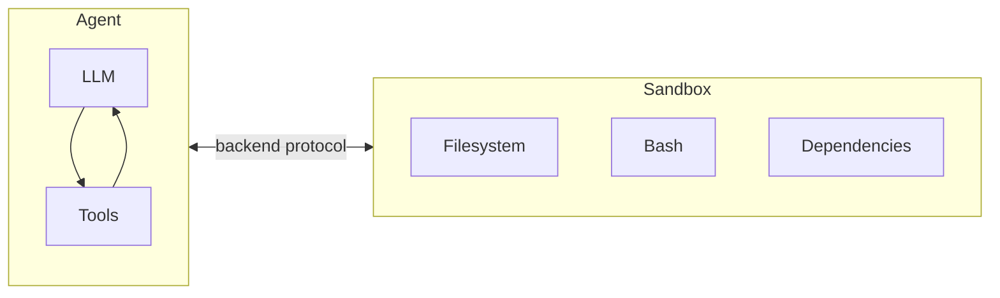
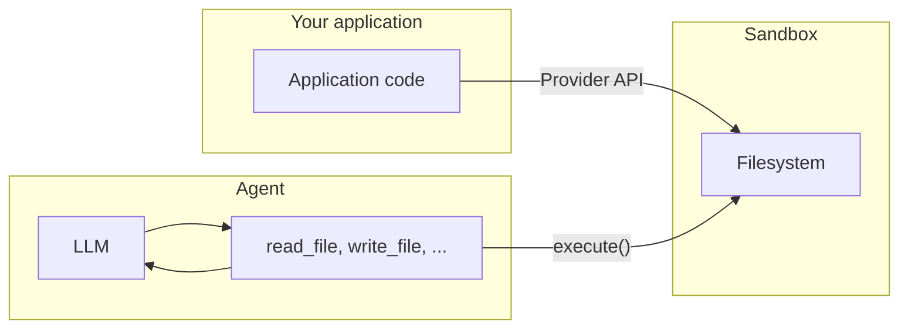

一旦 Agent 真正开始改文件、装依赖、跑命令，安全边界就不再是“以后再补”的附加能力，而会直接进入系统设计核心。沙箱的价值也不只是把执行能力做强，而是把这些能力装进一个隔离、可回收、可治理的环境里。理解沙箱，本质上也是在理解 Deep Agents 怎样从实验演示走向工程落地。

## 为什么值得关注

只要任务开始带来真实副作用，沙箱就会变成一条非常关键的基础设施线。它一方面让 Agent 继续拥有读写文件和执行命令的能力，另一方面又尽量避免这些动作直接落到宿主机上。也就是说，你不是在“给 Agent 更多权限”，而是在“给执行能力加边界”。

接入沙箱之后，Agent 往往就能安全地承担这些动作：

- 读写文件
- 运行 shell 命令
- 安装依赖
- 执行代码
- 生成构建产物或分析结果

沙箱的核心价值，不是“让 Agent 更强”，而是“让 Agent 在具备执行能力时不直接碰你的宿主机”。

---

## 沙箱是什么

在 Deep Agents 里，沙箱本质上是一类 backend。

和普通 backend 的区别是：

- 普通 backend 主要提供文件系统能力
- 沙箱 backend 除了文件系统能力，还额外提供 `execute` 工具

因此，Agent 一旦接入沙箱，就会同时拥有：

- `ls`
- `read_file`
- `write_file`
- `edit_file`
- `glob`
- `grep`
- `execute`

其中 `execute` 是关键差异，因为它允许 Agent 在隔离环境里直接运行命令。

### 沙箱在整体结构中的位置

先看这张图，会更容易理解为什么沙箱不是一个零散外挂，而是 Deep Agents 执行体系里的一个正式 backend。



这张图说明了沙箱不是“附加插件”，而是 Agent 的一种 backend。
Agent 仍在上层做规划和工具选择，真正的文件与命令执行落在隔离环境里。

---

## 为什么需要沙箱

只要 Agent 能写代码、改文件、跑命令，就必须认真考虑执行环境边界。

如果没有隔离层，Agent 的这些动作就会直接发生在你的宿主机上，风险包括：

- 读取本地敏感文件
- 接触环境变量里的密钥
- 修改真实项目文件
- 运行不可控命令
- 占满本地 CPU、内存、磁盘
- 借助网络把数据外传

沙箱的作用就是在 Agent 和宿主机之间建立边界。

这个边界的意义是：

- Agent 仍然可以执行高权限任务
- 但这些操作只发生在隔离环境里
- 宿主机上的文件、凭证和进程不会被直接暴露给 Agent

---

## 适合使用沙箱的场景

什么时候应该认真考虑沙箱，最简单的判断标准其实不是“我想不想用”，而是“这个 Agent 会不会真的动手执行”。只要答案是会，沙箱通常就值得优先进入方案评估。

### 编码型 Agent

如果你的 Agent 更像一个真正会动工程环境的编码助手，那么沙箱通常会特别合适。例如：

- 自动生成代码
- clone 仓库
- 安装依赖
- 运行测试
- 执行构建流程
- 执行 git 或 docker 相关命令

### 数据分析型 Agent

同样的逻辑也适用于数据分析场景。只要任务会落文件、装依赖、跑计算，沙箱就能把副作用控制在隔离环境里。例如：

- 上传数据文件
- 安装 `pandas`、`numpy` 等依赖
- 运行数据清洗与统计分析
- 生成图表、报告、PPT 等产物

### 一条经验规则

只要你的 Agent 需要“真实执行”而不是“只做文本回答”，就应该优先考虑沙箱。

---

## 基本使用方式

接入沙箱通常分为 4 步：

1. 使用对应 provider 的 SDK 创建 sandbox / devbox
2. 把 provider 对象封装成 Deep Agents backend
3. 把这个 backend 传给 `create_deep_agent(...)`
4. 任务完成后显式销毁或关闭沙箱

### Modal 示例

```python
import modal
from deepagents import create_deep_agent
from langchain_anthropic import ChatAnthropic
from langchain_modal import ModalSandbox

app = modal.App.lookup("your-app")
modal_sandbox = modal.Sandbox.create(app=app)
backend = ModalSandbox(sandbox=modal_sandbox)

agent = create_deep_agent(
    model=ChatAnthropic(model="claude-sonnet-4-6"),
    system_prompt="You are a Python coding assistant with sandbox access.",
    backend=backend,
)

try:
    result = agent.invoke(
        {
            "messages": [
                {
                    "role": "user",
                    "content": "Create a small Python package and run pytest",
                }
            ]
        }
    )
finally:
    modal_sandbox.terminate()
```

### 这段流程的关键点

- `ModalSandbox(...)` 把 provider 资源接入为 backend
- Agent 获得文件系统工具和 `execute`
- `try/finally` 保证即使出错，也能清理沙箱资源

这个模式在其他 provider 上也是一样的，只是创建与销毁沙箱的 SDK 不同。

---

## 常见 provider

可接入的沙箱 provider 包括：

- Modal
- Runloop
- Daytona
- LangSmith
- AgentCore

选择时优先考虑：

- 你当前基础设施里已经在用什么
- 是否支持 TTL
- 是否支持 metadata / labels
- 是否支持上传下载文件
- 是否支持网络限制
- 是否支持长期持久工作区

---

## 生命周期设计

真正把沙箱接进系统之后，你很快会发现，难点并不只是“怎么创建一个环境”，而是“这个环境应该活多久、绑定谁、什么时候销毁”。沙箱会持续消耗资源和费用，因此生命周期设计几乎总会成为落地时必须正面回答的问题。

这个问题本质上是在决定：

- 一个沙箱应该服务多久
- 一个沙箱应该绑定到什么业务对象上
- 什么时候自动清理

常见有两种生命周期设计。

---

## 线程级生命周期

线程级生命周期适合“每个对话一个沙箱”。

特点：

- 第一次进入该 thread 时创建沙箱
- 后续同 thread 消息复用同一个沙箱
- thread 被清理或 TTL 到期后，沙箱销毁

### 适合什么场景

- 每段对话都希望有干净环境
- 不希望不同会话共享依赖和文件
- 分析任务、一次性任务、临时实验任务

### 示例理解

一个数据分析机器人中：

- 用户每开启一次新会话
- 就得到一个全新的 Python 环境
- 不会读到其他对话遗留的文件

这是最推荐的默认模式。

---

## Assistant 级生命周期

Assistant 级生命周期适合“同一个 assistant 下所有线程共享一个沙箱”。

特点：

- 多个对话共享同一执行环境
- 依赖、文件、仓库、构建产物都能持续保留
- 更像一个长期工作区

### 适合什么场景

- 编码助手长期维护同一个仓库
- 需要跨会话保留安装的依赖
- 希望多次对话都在同一工作环境里继续做事

### 风险

长期共享环境会积累：

- 文件
- 依赖包
- 缓存
- 临时结果
- 克隆下来的仓库

如果不清理，磁盘和内存会不断膨胀。

### 推荐措施

- 配置 TTL
- 定期从快照重置
- 建立清理逻辑
- 对长期目录做限额管理

---

## 基本生命周期操作

不管是哪种 provider，核心生命周期动作都差不多：

1. 创建沙箱
2. 执行任务
3. 关闭或删除沙箱

### Daytona 示例

```python
from daytona import Daytona
from langchain_daytona import DaytonaSandbox

sandbox = Daytona().create()
backend = DaytonaSandbox(sandbox=sandbox)

result = backend.execute("echo hello")
# ... use sandbox
sandbox.stop()
```

### Runloop 示例

```python
from runloop_api_client import RunloopSDK
from langchain_runloop import RunloopSandbox

client = RunloopSDK(bearer_token="...")
devbox = client.devbox.create()
backend = RunloopSandbox(devbox=devbox)

result = backend.execute("echo hello")
# ... use sandbox
devbox.shutdown()
```

### 一个重要习惯

所有沙箱对象都应该有明确的销毁路径。  
不要依赖“进程退出后自然释放”。

---

## 对话型应用中的 get-or-create 模式

在聊天应用里，通常会把一个会话映射成一个 `thread_id`。

最佳实践通常是：

- 每个 `thread_id` 对应一个唯一沙箱
- 如果沙箱已存在则复用
- 不存在则创建
- 空闲过久则自动清理

### Daytona 示例

```python
from langchain_core.utils.uuid import uuid7

from daytona import CreateSandboxFromSnapshotParams, Daytona
from deepagents import create_deep_agent
from langchain_daytona import DaytonaSandbox

client = Daytona()
thread_id = str(uuid7())

try:
    sandbox = client.find_one(labels={"thread_id": thread_id})
except Exception:
    params = CreateSandboxFromSnapshotParams(
        labels={"thread_id": thread_id},
        auto_delete_interval=3600,
    )
    sandbox = client.create(params)

backend = DaytonaSandbox(sandbox=sandbox)
agent = create_deep_agent(
    model="google_genai:gemini-3.1-pro-preview",
    backend=backend,
    system_prompt="You are a coding assistant with sandbox access. You can create and run code in the sandbox.",
)

try:
    result = agent.invoke(
        {
            "messages": [
                {
                    "role": "user",
                    "content": "Create a hello world Python script and run it",
                }
            ]
        },
        config={
            "configurable": {
                "thread_id": thread_id,
            }
        },
    )
    print(result["messages"][-1].content)
except Exception:
    client.delete(sandbox)
    raise
```

### 这里的核心思路

- 通过 `thread_id` 找到已有沙箱
- 没有就创建
- 通过 provider 的 labels / metadata 把沙箱和会话绑定
- 用 TTL 自动清理长时间空闲的沙箱

### 为什么 TTL 很重要

聊天应用里，用户可能：

- 10 分钟后回来
- 3 天后回来
- 永远不回来

如果没有 TTL：

- 沙箱会长期占资源
- 成本不可控
- 存储和内存会不断积累

---

## 两种集成架构模式

Agent 和沙箱结合起来之后，接下来要做的其实是一个很典型的架构选择：究竟是把 Agent 整体搬进沙箱里运行，还是把沙箱当成一个被调用的执行后端。两种方式都能工作，但适合的工程边界并不一样。

---

## 模式一：Agent 运行在沙箱里

这种模式更像是在沙箱里“托管整个 Agent 运行时”。也就是说，沙箱不只是提供执行能力，而是直接承载 Agent 本身。

这种模式下：

- Agent 框架本身跑在沙箱内部
- 你的应用通过网络和沙箱内的 Agent 通信

### 工作方式

通常做法是：

- 构建一个带有 Agent 代码和依赖的镜像
- 在沙箱中启动它
- 再通过 HTTP / WebSocket 等方式和它交互

### 好处

- 更接近本地开发环境
- Agent 与执行环境强耦合
- 适合“整个应用都以沙箱为宿主”这种模式

### 代价

- API key 往往需要放进沙箱内部
- 更新 Agent 逻辑可能需要重建镜像
- 需要额外做通信层基础设施

### 示例镜像

```dockerfile
FROM python:3.11
RUN pip install deepagents-cli
```

### 什么时候适合这种模式

适合：

- provider 已经帮你封装了完整通信层
- 你希望生产环境尽量逼近本地运行方式
- 你愿意为环境一致性承担更重的运维复杂度

---

## 模式二：沙箱作为工具

另一种思路则更贴近大多数应用的现实做法：Agent 仍然跑在你自己的服务端或本地环境里，只有在需要执行文件操作和命令时，才把动作交给沙箱 backend。

这种模式下：

- Agent 运行在你的服务端或本地环境
- 当 Agent 需要执行文件操作或命令时，再通过 sandbox backend 调 provider API

### 好处

- Agent 逻辑改动不需要重建镜像
- API key 可以留在沙箱外部
- Agent 状态和执行环境分离更清晰
- 一个应用可以并行调度多个沙箱
- 只为执行时长付费，资源利用率更高

### 代价

- 每次执行操作都要走网络
- 会引入额外延迟

### 示例

```python
from daytona import Daytona
from deepagents import create_deep_agent
from dotenv import load_dotenv
from langchain_daytona import DaytonaSandbox

load_dotenv()

sandbox = Daytona().create()
backend = DaytonaSandbox(sandbox=sandbox)

agent = create_deep_agent(
    model="google_genai:gemini-3.1-pro-preview",
    backend=backend,
    system_prompt="You are a coding assistant with sandbox access. You can create and run code in the sandbox.",
)

try:
    result = agent.invoke(
        {
            "messages": [
                {
                    "role": "user",
                    "content": "Create a hello world Python script and run it",
                }
            ]
        }
    )
    print(result["messages"][-1].content)
except Exception:
    sandbox.stop()
    raise
```

### 什么时候适合这种模式

适合：

- 需要快速迭代 Agent 逻辑
- 不希望密钥进入沙箱
- 希望把 Agent 状态和执行环境分离
- 希望灵活调度多沙箱任务

### 实操中的默认建议

大多数场景优先使用“沙箱作为工具”模式。

---

## 沙箱是如何工作的

### 核心机制：`execute()`

沙箱 backend 的核心实现点非常集中：

- provider 只需要真正实现 `execute()`

其他文件能力，例如：

- `read`
- `write`
- `edit`
- `ls`
- `glob`
- `grep`

实际上都可以由基础类通过拼接脚本并调用 `execute()` 来实现。

### 这意味着什么

- 新增一个 sandbox provider 的接入成本较低
- 只要能远程执行命令，就能构建出完整的文件系统能力
- `execute` 是 sandbox backend 的关键能力来源

### 一个重要细节

只有当 backend 实现了 `SandboxBackendProtocol`，Agent 才会看到 `execute` 工具。

如果 backend 只是普通文件系统 backend：

- Agent 看不到 `execute`
- 也就无法运行命令

### 沙箱作为 backend 的执行模型

如果前面那种“provider 只要实现 `execute()` 就能衍生出整套文件能力”的说法还比较抽象，可以先看下面这张图，再去理解它们之间的调用关系。

```mermaid
graph TB
    subgraph AgentTools[Agent tools]
        Tools[ls, read_file, ...]
        ExecuteTool[execute]
    end

    BaseSandbox[BaseSandbox\n(uses execute)] --> Tools
    ExecuteMethod[execute()] --> BaseSandbox
    ExecuteMethod --> ExecuteTool
    Provider[Provider SDK] --> ExecuteMethod
```

这个关系很关键，因为它解释了为什么很多 sandbox provider 只需要把 `execute()` 做好，其他文件工具能力就能被统一派生出来。

---

## `execute()` 返回什么

当 Agent 调用 `execute` 时，一般会传入：

- `command`

然后返回：

- stdout / stderr 合并后的输出
- 退出码
- 若输出过大时的截断提示

### 成功示例

```text
4
[Command succeeded with exit code 0]
```

### 失败示例

```text
bash: foobar: command not found
[Command failed with exit code 127]
```

### 输出过大的处理方式

如果命令输出过大，系统通常不会把全部结果直接塞回上下文，而是：

- 自动把输出写到文件
- 再提示 Agent 用 `read_file` 分段读取

这样做是为了避免上下文窗口被一次性撑爆。

---

## 两种文件访问平面

理解沙箱时，最容易混淆的一点，是“文件到底是怎么进出沙箱的”。很多实现上的误会，都是从把这两条路径混在一起开始的。所以这里最好先停一下，把 Agent 任务内的文件访问，和应用侧跨边界的文件传输明确拆开。

实际上有两套完全不同的路径。

### 第一种：Agent 内部文件系统工具

这是 Agent 在执行任务时使用的工具：

- `read_file`
- `write_file`
- `edit_file`
- `ls`
- `glob`
- `grep`
- `execute`

这些工具：

- 是 LLM 在任务过程中调用的
- 最终都通过沙箱内部的 `execute()` 机制生效

适合：

- Agent 自己读代码
- Agent 自己写文件
- Agent 自己执行命令

### 第二种：应用侧文件传输 API

这是你的应用代码使用的接口：

- `upload_files()`
- `download_files()`

这些接口：

- 不是给 Agent 用的
- 不通过 shell 命令
- 直接使用 provider 的文件传输 API
- 用于把宿主环境和沙箱之间的文件做边界传输

适合：

- 在 Agent 运行前预置项目文件
- 在 Agent 运行后取回产物
- 提前注入依赖配置、输入数据、模板文件

### 一句区分方法

- Agent 任务中用文件工具
- 应用和沙箱之间传文件用 `upload_files()` / `download_files()`

### 两种文件访问平面示意

先看这张图，再去读下面的说明，会更容易把“Agent 内部工具调用”和“应用侧上传下载”这两条线区分开。



这张图对应两个完全不同的入口：

- Agent 在任务过程中，通过工具和 `execute()` 间接操作沙箱文件系统
- 你的应用代码在任务前后，通过 provider 的文件传输 API 进出沙箱

---

## 如何预置文件到沙箱

在 Agent 开始工作前，通常需要把代码、配置或数据先放进沙箱。

这时使用 `upload_files()`。

### Daytona 示例

```python
from daytona import Daytona
from langchain_daytona import DaytonaSandbox

sandbox = Daytona().create()
backend = DaytonaSandbox(sandbox=sandbox)

backend.upload_files(
    [
        ("/src/index.py", b"print('Hello')\n"),
        ("/pyproject.toml", b"[project]\nname = 'my-app'\n"),
    ]
)
```

### 使用规则

- 路径必须是绝对路径
- 内容是 `bytes`

### 适合预置的内容

- 项目源代码
- 配置文件
- 数据集
- 测试样例
- 依赖声明文件

---

## 如何取回沙箱产物

任务结束后，如果需要把生成结果从沙箱拿回宿主环境，就使用 `download_files()`。

### Daytona 示例

```python
from daytona import Daytona
from langchain_daytona import DaytonaSandbox

sandbox = Daytona().create()
backend = DaytonaSandbox(sandbox=sandbox)

results = backend.download_files(["/src/index.py", "/output.txt"])
for result in results:
    if result.content is not None:
        print(f"{result.path}: {result.content.decode()}")
    else:
        print(f"Failed to download {result.path}: {result.error}")
```

### 适合取回的内容

- 生成后的代码文件
- 测试报告
- 构建产物
- 日志文件
- 分析报告
- 导出的图表或文档

---

## 安全边界到底保护了什么

说到这里，很容易自然得出一个过度乐观的结论：既然已经有沙箱，是不是很多安全问题就自动解决了？实际上，沙箱保护的是一部分边界，而且是非常重要的一部分，但它并不是万能安全层。

沙箱能保护的是：

- 宿主机文件系统
- 宿主机环境变量
- 宿主机进程与资源

也就是说，Agent 在沙箱里乱跑命令，主要影响的是沙箱内部，不会直接触达你本地机器。

但是要注意，沙箱并不是万能安全方案。

它不能自动防住两类重要风险。

---

## 风险一：上下文注入

如果攻击者控制了 Agent 的部分输入内容，他可能诱导 Agent 在沙箱内执行任意命令。

沙箱虽然把宿主机保护住了，但并没有阻止：

- Agent 在沙箱里读文件
- Agent 在沙箱里执行恶意命令
- Agent 在沙箱里收集内部数据

换句话说：

- 沙箱保护的是宿主机
- 不是保护“沙箱内部永远安全”

---

## 风险二：网络外传

如果沙箱允许联网，那么被注入的 Agent 仍可能：

- 把数据通过 HTTP 发出去
- 通过 DNS 外带信息
- 与外部恶意服务通信

因此：

- 沙箱隔离 != 自动防止数据外传

如果任务不需要联网，应尽量阻断网络。

---

## 关于密钥的最重要规则

不要把 secrets 放进沙箱。

包括但不限于：

- API keys
- Access tokens
- 数据库凭证
- 云平台凭证
- 挂载进去的敏感文件
- 通过 env 注入的敏感配置

原因很直接：

- 如果 Agent 能读到这些密钥
- 被上下文注入后，攻击者也就能间接拿到这些密钥

即使这些密钥：

- 是短期的
- 是只读的
- 是低权限的

也依然存在被滥用和外传的风险。

---

## 更安全的密钥处理方式

### 方式一：把认证逻辑放在沙箱外部工具里

这是最推荐的方式。

思路是：

- 密钥留在宿主服务端
- 把需要认证的操作封装成 host-side tool
- Agent 只知道工具名，不知道真实密钥

例如：

- Agent 调 `search_internal_docs()`
- 真正的 API token 在你的服务端工具实现里
- 沙箱里从头到尾都看不到 token

### 方式二：使用代理层自动注入认证

有些 sandbox provider 可能支持：

- 沙箱内发出普通请求
- 由代理自动补上认证头

这样 Agent 看到的是普通 URL，而不是密钥本身。

这种能力并不是所有 provider 都有，因此可用性取决于具体平台。

---

## 如果你非要把 secrets 放进沙箱

这不是推荐做法，但如果业务上暂时绕不开，至少要加这些防护：

- 对所有工具调用开启人工审批
- 阻断或严格限制沙箱网络
- 使用最小权限、最短时效的凭证
- 监控异常外连流量

即便如此，这仍然不是安全解法，只能算风险缓解。

原因是：

- 一个足够巧妙的上下文注入攻击，可能绕过简单的输出过滤或人工审查

---

## 通用安全实践

不管使用哪个 provider，都建议遵循这些规则：

- 把沙箱内产生的一切结果视为不可信输入
- 对关键输出做审核后再进入你的主系统
- 不需要联网时，尽量关闭沙箱网络
- 用中间件过滤或脱敏工具输出中的敏感模式
- 避免把宿主机 secrets 映射进沙箱

---

## 什么时候选沙箱，而不是 `LocalShellBackend`

很多人真正做选型时，不是在“普通 backend 和沙箱”之间犹豫，而是在“直接本地执行”与“隔离执行”之间犹豫。这个判断标准可以尽量简单一点：只要你开始在意边界、风险和可回收性，沙箱通常就更合适。

一个简单判断标准：

### 选 `LocalShellBackend`

前提是同时满足：

- 你在本地可信开发环境
- 你知道 Agent 将接触什么
- 你接受它直接操作宿主机
- 你不需要真正的隔离边界

### 选沙箱

只要满足以下任一条件，就优先选沙箱：

- 希望隔离执行环境
- 不希望宿主机暴露给 Agent
- 任务需要执行命令
- 需要上传/下载工件
- 需要适配生产环境
- 需要更可控的资源生命周期

---

## 选 provider 时的关注点

不同 sandbox provider 的 SDK 和生命周期控制不同，但选型时关注点大致一致：

- 是否支持 TTL
- 是否支持 labels 或 metadata
- 是否支持文件上传下载
- 是否支持网络限制
- 是否支持快照
- 是否支持长期工作区
- 是否支持适合你业务的地域与延迟
- 成本模型是否可接受

如果你做的是对话型应用，优先关注：

- `thread_id` 到 sandbox 的映射能力
- 自动清理能力
- 长期空闲成本

---

## 常见错误与排查

### 把沙箱当成“绝对安全”环境

常见误区：

- 以为有了沙箱，就不用担心 prompt injection 或数据外传

纠正理解：

- 沙箱主要保护宿主机
- 不会自动阻止沙箱内恶意行为

### 没有清理沙箱，成本持续增长

常见原因：

- 创建了 sandbox / devbox
- 但没有 `stop()` / `shutdown()` / `terminate()` / 删除

解决：

- 统一封装生命周期
- 用 `try/finally`
- 配 TTL

### 把应用文件传输和 Agent 文件工具混为一谈

常见问题：

- 以为 `upload_files()` 是给 Agent 调用的
- 以为 Agent 自己能直接访问宿主文件

正确理解：

- Agent 在沙箱内只能通过工具操作沙箱文件系统
- 宿主与沙箱之间的跨边界传输，要用应用侧 `upload_files()` / `download_files()`

### 共享沙箱后环境越来越脏

常见原因：

- 采用 assistant-scoped 生命周期
- 但没有做重置、快照回滚或清理

解决：

- 加 TTL
- 定期清理
- 必要时改回 thread-scoped

### 把密钥放进沙箱

这是最高风险误用之一。

解决：

- 把认证逻辑移到 host-side tool
- 或使用支持认证代理的 provider 能力

### 命令输出太大导致结果异常

常见情况：

- 命令产生海量 stdout/stderr
- 直接返回上下文会撑爆 token

正确理解：

- 大输出应落盘
- 再通过 `read_file` 分段读取

---

## 验收标准

可以用下面的标准判断沙箱接入是否正确：

- Agent 能在沙箱内正常读写文件
- Agent 能通过 `execute` 成功运行命令
- 上传的预置文件能被 Agent 正确读取
- 生成的工件能被应用正确下载
- 会话与沙箱之间的映射关系清晰
- 沙箱空闲后能按预期清理
- 宿主机 secrets 没有进入沙箱
- 在需要时可以限制网络或接入人工审批

---

## 推荐实操顺序

建议按下面顺序落地：

1. 先选一个 sandbox provider
2. 先用最简单示例跑通 `execute("echo hello")`
3. 再接入 `create_deep_agent(...)`
4. 测试 Agent 是否能创建文件并运行命令
5. 加上 `upload_files()` 预置项目文件
6. 加上 `download_files()` 取回结果
7. 再设计 thread-scoped 或 assistant-scoped 生命周期
8. 最后再补 TTL、网络限制、审批和审计逻辑

---

## 关键要点

- 沙箱是一类特殊 backend
- 它除了文件系统工具，还提供 `execute`
- 沙箱的价值是隔离宿主机，而不是让 Agent 无限制更安全
- 对话型应用通常按 `thread_id` 管理沙箱生命周期
- “沙箱作为工具”通常是更灵活的默认架构
- 宿主与沙箱传文件用 `upload_files()` / `download_files()`
- 绝对不要把 secrets 直接放进沙箱

---

## 写在最后

沙箱的本质，是给 Deep Agent 提供一个“可执行但隔离”的工作区。

可以把它理解成三层价值：

- 第一层：让 Agent 真正能跑代码和命令
- 第二层：把这些动作限制在隔离环境里
- 第三层：通过生命周期、文件传输和安全策略，把这种执行能力变成可控的工程能力

当你把这三层设计清楚之后，沙箱才不是一个“能跑命令的玩具环境”，而是可以支撑真实智能体系统落地的执行基础设施。
