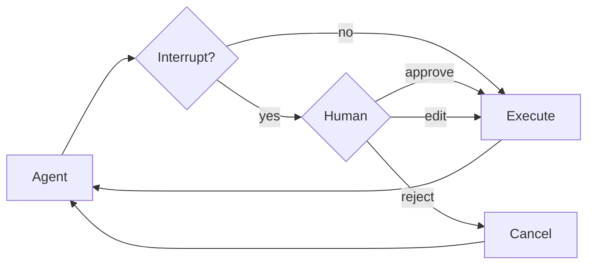

只要 Agent 真正具备执行能力，就迟早会遇到一个绕不过去的问题：哪些动作可以自动完成，哪些动作必须在人类确认后再继续。Deep Agents 并没有把这个问题简化成一个“确认按钮”，而是把审批做成了一条可暂停、可恢复、可编排的执行链路，这也是它能进入真实业务流程的重要前提。

## 为什么值得关注

人工审批的价值不在于让 Agent 变慢，而在于把“直接执行”改造成“先暂停、可审查、再恢复”的受控流程。只有这样，高风险动作才不会因为一次错误判断就立刻落地。

这套机制尤其适合控制这些会产生真实后果的动作：

- 删除文件
- 修改关键文件
- 发送邮件
- 发起上线操作
- 调用高风险业务工具
- 任何“执行了就会产生真实后果”的动作

它的核心价值不是让 Agent 变慢，而是把“自动执行”改造成“可中断、可审查、可恢复”的执行流程。

---

## 这套机制解决什么问题

默认情况下，Agent 一旦决定调用某个工具，就会直接执行。

这在低风险场景下没有问题，但在高风险场景里会带来明显风险：

- 误删文件
- 错发邮件
- 用错误参数执行关键命令
- 把尚未确认的动作直接落地

人工审批的作用就是：

- Agent 提出要执行的动作
- 系统先暂停
- 人类查看动作内容
- 决定批准、修改还是拒绝
- 然后 Agent 再继续执行剩余流程

可以把它理解成：

- Agent 负责决策与建议
- 人类负责关键节点把关

### 审批执行流

先用这条执行链路看一眼中断到底发生在什么位置，再往下看 `interrupt_on` 和恢复执行的代码，会更容易把整个机制串起来。



这张图对应的就是整套审批机制的核心路径：先判断是否命中 `interrupt_on`，命中后暂停交给人类，再根据决策恢复或取消。

---

## 核心配置入口：`interrupt_on`

人工审批通过 `interrupt_on` 参数配置。

它的本质是一个字典：

- key：工具名
- value：该工具是否需要中断审批，以及允许哪些决策

### 最基础示例

```python
from langchain.tools import tool
from deepagents import create_deep_agent
from langgraph.checkpoint.memory import MemorySaver

@tool
def delete_file(path: str) -> str:
    """Delete a file from the filesystem."""
    return f"Deleted {path}"

@tool
def read_file(path: str) -> str:
    """Read a file from the filesystem."""
    return f"Contents of {path}"

@tool
def send_email(to: str, subject: str, body: str) -> str:
    """Send an email."""
    return f"Sent email to {to}"

checkpointer = MemorySaver()

agent = create_deep_agent(
    model="google_genai:gemini-3.1-pro-preview",
    tools=[delete_file, read_file, send_email],
    interrupt_on={
        "delete_file": True,
        "read_file": False,
        "send_email": {"allowed_decisions": ["approve", "reject"]},
    },
    checkpointer=checkpointer
)
```

### 这个配置表达了什么

- `delete_file`
  - 需要人工审批
  - 默认允许三种操作：批准、修改、拒绝

- `read_file`
  - 不需要中断
  - 直接执行

- `send_email`
  - 需要人工审批
  - 但只允许批准或拒绝，不允许修改参数

---

## `interrupt_on` 的三种写法

### 写法一：`True`

```python
"delete_file": True
```

表示：

- 启用中断审批
- 使用默认决策集

默认通常包含：

- `approve`
- `edit`
- `reject`

### 写法二：`False`

```python
"read_file": False
```

表示：

- 该工具不需要人工审批
- Agent 可以直接执行

### 写法三：显式配置可选决策

```python
"send_email": {"allowed_decisions": ["approve", "reject"]}
```

表示：

- 该工具需要审批
- 但审批人只能批准或拒绝
- 不能改参数

这种方式最适合按风险等级做细分控制。

---

## 三种决策类型

人工审批阶段，通常有三种决策。

### `approve`

含义：

- 按 Agent 原始提出的参数原样执行

适合：

- 参数可信
- 动作合理
- 不需要人工修正

### `edit`

含义：

- 不直接使用 Agent 原始参数
- 人工先改参数，再执行

适合：

- 动作是对的
- 但参数需要修正
- 例如邮件收件人错了、文件路径错了、范围太大了

### `reject`

含义：

- 这次工具调用直接跳过
- 不执行

适合：

- 动作本身不应该发生
- 参数存在严重问题
- 当前阶段不允许该操作执行

---

## 如何按风险等级配置工具

真正开始接业务时，最关键的问题通常不是“要不要审批”，而是“哪些动作该审批到什么程度”。如果所有工具都一刀切，体验会非常差；如果放得太开，又容易把高风险动作直接交给模型。按风险分层配置，基本就是在效率和控制之间找平衡。

### 高风险工具

高风险工具的共同特点是：一旦执行错误，后果往往已经发生，而且通常很难靠后续补救完全消除。例如：

- `delete_file`
- `send_email`
- `deploy_to_prod`

建议：

- 允许 `approve`
- 允许 `edit`
- 允许 `reject`

配置示例：

```python
interrupt_on = {
    "delete_file": {"allowed_decisions": ["approve", "edit", "reject"]},
    "send_email": {"allowed_decisions": ["approve", "edit", "reject"]},
}
```

### 中风险工具

中风险工具往往不是绝对不能自动执行，而是更适合用“要么照计划执行，要么直接拦下”这种简单判断。例如：

- `write_file`
- `update_record`

建议：

- 允许 `approve`
- 允许 `reject`
- 不允许 `edit`

原因：

- 有时人工修改参数反而容易破坏系统约束
- 这类工具更适合“要么执行，要么不执行”

配置示例：

```python
interrupt_on = {
    "write_file": {"allowed_decisions": ["approve", "reject"]},
}
```

### 极低风险工具

只读类工具通常更适合保持低摩擦。如果每一次读取和搜索都要审批，整个 Agent 的工作流很快就会被打断得非常碎。例如：

- `read_file`
- `list_files`
- 某些只读搜索工具

建议：

- 不要中断

配置示例：

```python
interrupt_on = {
    "read_file": False,
    "list_files": False,
}
```

### 特殊场景：必须批准，不能拒绝

也有一些流程约束非常强的场景，系统设计上就是不允许“模糊通过”或“跳过这一步”。虽然这不是最常见的配置，但在某些强审批链里确实会出现：

- 一旦到这一步，只能明确批准才能继续

配置示例：

```python
interrupt_on = {
    "critical_operation": {"allowed_decisions": ["approve"]},
}
```

这种配置适合非常强流程约束的场景，但要谨慎使用。

---

## 为什么 `checkpointer` 是必需项

一旦把审批理解成“中途暂停，再从原地继续”，`checkpointer` 的必要性就会非常直观。它不是为了让系统更高级，而是为了让“停下来之后还能继续”这件事真正成立。

人工审批本质上是一种“暂停后恢复”的工作流。

流程是：

1. Agent 运行到某个工具调用点
2. 因为命中 `interrupt_on`，系统暂停
3. 当前执行状态需要被保存
4. 等待人类输入决策
5. 再从中断点恢复执行

如果没有 `checkpointer`：

- 暂停时状态无法可靠保存
- 恢复时就不知道从哪里接着执行

所以人工审批场景里，`checkpointer` 不是可选优化，而是必需组件。

### 最基础写法

```python
from langgraph.checkpoint.memory import MemorySaver

checkpointer = MemorySaver()
```

然后传给 Agent：

```python
agent = create_deep_agent(
    ...,
    checkpointer=checkpointer,
)
```

---

## 如何处理一次中断

从接入角度看，真正需要你写代码处理的地方，就是这里：Agent 不是直接返回最终结果，而是先把一个“待审批状态”交还给你。你的应用需要读取这个状态、展示给人、收集决策，再把决策送回去。

当 Agent 触发人工审批时，它不会直接完成任务，而是返回一个中断结果。

你需要做的是：

1. 检查是否发生中断
2. 读取待审批动作
3. 生成用户决策
4. 用 `Command(resume=...)` 恢复执行

### 完整示例

```python
from langchain_core.utils.uuid import uuid7
from langgraph.types import Command

config = {"configurable": {"thread_id": str(uuid7())}}

result = agent.invoke(
    {"messages": [{"role": "user", "content": "Delete the file temp.txt"}]},
    config=config,
    version="v2",
)

if result.interrupts:
    interrupt_value = result.interrupts[0].value
    action_requests = interrupt_value["action_requests"]
    review_configs = interrupt_value["review_configs"]

    config_map = {cfg["action_name"]: cfg for cfg in review_configs}

    for action in action_requests:
        review_config = config_map[action["name"]]
        print(f"Tool: {action['name']}")
        print(f"Arguments: {action['args']}")
        print(f"Allowed decisions: {review_config['allowed_decisions']}")

    decisions = [
        {"type": "approve"}
    ]

    result = agent.invoke(
        Command(resume={"decisions": decisions}),
        config=config,
        version="v2",
    )

print(result.value["messages"][-1].content)
```

---

## 为什么一定要用同一个 `thread_id`

恢复执行时，必须使用和第一次调用完全相同的 `thread_id`。

因为：

- 中断点状态是保存在这个 thread 上的
- 恢复时系统要去同一个 thread 找回上下文

如果你换了 `thread_id`：

- 系统会把它当成一个新的执行上下文
- 原来的中断状态找不到
- 恢复流程就会失败或跑偏

### 正确做法

```python
config = {"configurable": {"thread_id": "my-thread"}}

result = agent.invoke(input, config=config, version="v2")
result = agent.invoke(Command(resume={...}), config=config, version="v2")
```

### 必须保持一致的内容

恢复时至少要保持：

- 同一个 `thread_id`
- 同一个 `config`
- 同一个 `version="v2"`

---

## 为什么示例里使用 `version="v2"`

人工审批和中断恢复流程依赖中断信息在结果对象中的稳定表现形式。

在处理这类执行控制逻辑时，应显式使用：

```python
version="v2"
```

这样可以确保：

- 中断信息出现在预期位置
- 恢复流程与返回结果结构一致
- 代码行为更稳定、可预期

---

## 如何读取中断信息

当 `result.interrupts` 不为空时，说明发生了中断。

中断结果里最关键的通常有两个字段：

- `action_requests`
- `review_configs`

### `action_requests`

它表示：

- 当前有哪些待审批动作
- 每个动作的工具名是什么
- 参数是什么

### `review_configs`

它表示：

- 每个工具当前允许哪些决策

通常会先把二者拼起来，形成“动作 + 决策范围”的完整视图，再展示给用户。

---

## 多个工具同时触发审批时怎么办

如果一次执行里同时调用了多个需要审批的工具，它们通常会被打包进同一个 interrupt。

这意味着：

- 你不会收到多个分散中断
- 而是一次性收到多个待审批动作

### 示例

```python
config = {"configurable": {"thread_id": str(uuid7())}}

result = agent.invoke(
    {"messages": [{
        "role": "user",
        "content": "Delete temp.txt and send an email to admin@example.com"
    }]},
    config=config,
    version="v2",
)

if result.interrupts:
    interrupt_value = result.interrupts[0].value
    action_requests = interrupt_value["action_requests"]

    assert len(action_requests) == 2

    decisions = [
        {"type": "approve"},
        {"type": "reject"}
    ]

    result = agent.invoke(
        Command(resume={"decisions": decisions}),
        config=config,
        version="v2",
    )
```

### 这里最容易出错的地方

决策列表 `decisions` 的顺序必须严格对应 `action_requests` 的顺序。

也就是说：

- 第 1 个 decision 对应第 1 个 action
- 第 2 个 decision 对应第 2 个 action

顺序错了，就会把错误决策作用到错误工具上。

### 一个稳妥写法

```python
if result.interrupts:
    interrupt_value = result.interrupts[0].value
    action_requests = interrupt_value["action_requests"]

    decisions = []
    for action in action_requests:
        decision = get_user_decision(action)
        decisions.append(decision)

    result = agent.invoke(
        Command(resume={"decisions": decisions}),
        config=config,
        version="v2",
    )
```

---

## 如何修改工具参数后再执行

如果某个工具允许 `edit`，就可以在批准执行前改参数。

### 示例

```python
if result.interrupts:
    interrupt_value = result.interrupts[0].value
    action_request = interrupt_value["action_requests"][0]

    print(action_request["args"])

    decisions = [{
        "type": "edit",
        "edited_action": {
            "name": action_request["name"],
            "args": {"to": "team@company.com", "subject": "...", "body": "..."}
        }
    }]

    result = agent.invoke(
        Command(resume={"decisions": decisions}),
        config=config,
        version="v2",
    )
```

### `edit` 时必须注意什么

编辑后的动作里，必须显式带上：

- 工具名 `name`
- 完整参数 `args`

不要只改局部字段而忽略其他参数，除非你的上层逻辑已经确保参数补全。

### `edit` 最适合哪些场景

例如：

- 邮件收件人需要改
- 删除路径需要缩小范围
- 写文件目标路径需要修正
- 调用外部接口时参数需要人工确认

---

## 子代理中的人工审批

子代理也可以参与人工审批，而且有两种层面。

---

## 子代理层面一：对子代理工具调用做审批

每个子代理都可以有自己的 `interrupt_on` 配置。

如果子代理里也定义了同名工具，那么它自己的 `interrupt_on` 可以覆盖主 Agent 的配置。

### 示例

```python
agent = create_deep_agent(
    model="google_genai:gemini-3.1-pro-preview",
    tools=[delete_file, read_file],
    interrupt_on={
        "delete_file": True,
        "read_file": False,
    },
    subagents=[{
        "name": "file-manager",
        "description": "Manages file operations",
        "system_prompt": "You are a file management assistant.",
        "tools": [delete_file, read_file],
        "interrupt_on": {
            "delete_file": True,
            "read_file": True,
        }
    }],
    checkpointer=checkpointer
)
```

### 这个例子说明什么

主 Agent：

- 删除文件要审批
- 读文件不审批

子代理 `file-manager`：

- 删除文件也要审批
- 但读文件在这个子代理中也要求审批

这意味着审批策略可以按角色细分，而不必全局一刀切。

---

## 子代理层面二：工具内部直接调用 `interrupt()`

除了“对工具调用本身做审批”，还可以在工具逻辑内部直接调用 `interrupt()`，实现更细粒度的人机协同。

这种方式适合：

- 工具内部执行到一半时需要人工确认
- 不是简单的“要不要调用工具”，而是“工具内部某一步要不要继续”

### 示例

```python
from langchain.agents import create_agent
from langchain_anthropic import ChatAnthropic
from langchain.messages import HumanMessage
from langchain.tools import tool
from langgraph.checkpoint.memory import InMemorySaver
from langgraph.types import Command, interrupt

from deepagents.graph import create_deep_agent
from deepagents.middleware.subagents import CompiledSubAgent

@tool(description="Request human approval before proceeding with an action.")
def request_approval(action_description: str) -> str:
    """Request human approval using the interrupt() primitive."""
    approval = interrupt({
        "type": "approval_request",
        "action": action_description,
        "message": f"Please approve or reject: {action_description}",
    })

    if approval.get("approved"):
        return f"Action '{action_description}' was APPROVED. Proceeding..."
    else:
        return f"Action '{action_description}' was REJECTED. Reason: {approval.get('reason', 'No reason provided')}"


def main():
    checkpointer = InMemorySaver()
    model = ChatAnthropic(
        model_name="claude-sonnet-4-6",
        max_tokens=4096,
    )

    compiled_subagent = create_agent(
        model=model,
        tools=[request_approval],
        name="approval-agent",
    )

    parent_agent = create_deep_agent(
        model="google_genai:gemini-3.1-pro-preview",
        checkpointer=checkpointer,
        subagents=[
            CompiledSubAgent(
                name="approval-agent",
                description="An agent that can request approvals",
                runnable=compiled_subagent,
            )
        ],
    )

    thread_id = "test_interrupt_directly"
    config = {"configurable": {"thread_id": thread_id}}

    result = parent_agent.invoke(
        {
            "messages": [
                HumanMessage(
                    content="Use the task tool to launch the approval-agent sub-agent. "
                    "Tell it to use the request_approval tool to request approval for 'deploying to production'."
                )
            ]
        },
        config=config,
        version="v2",
    )

    if result.interrupts:
        interrupt_value = result.interrupts[0].value

        result2 = parent_agent.invoke(
            Command(resume={"approved": True}),
            config=config,
            version="v2",
        )
```

### 这类方式适合什么

适合：

- 审批动作不是固定绑在某个工具名上
- 某个工具内部有多个风险节点
- 你想把审批逻辑设计成业务流程的一部分

### 和 `interrupt_on` 的区别

- `interrupt_on`：工具调用前统一拦截
- `interrupt()`：工具内部在任意节点主动暂停

二者可以同时存在。

---

## 实践中的设计建议

### 先按风险分层，再决定是否审批

不要一股脑把所有工具都设成审批。

更合理的分法是：

#### 高风险

- 删除
- 发信
- 对外发布
- 生产变更

建议：

- `approve + edit + reject`

#### 中风险

- 写文件
- 更新记录
- 触发内部流程

建议：

- `approve + reject`

#### 低风险

- 读文件
- 搜索
- 列目录

建议：

- 不中断

---

## 审批界面应该展示什么

如果你要自己做审批 UI，至少应给用户展示：

- 工具名
- 工具参数
- 允许的决策类型
- 该操作的上下文说明

如果是 `edit` 场景，最好还能展示：

- 原始参数
- 编辑后的参数
- 差异对比

这样审批才真正可用，而不是机械点按钮。

---

## 常见错误与排查

### 配了 `interrupt_on` 但没有触发审批

常见原因：

- 工具根本没有被调用
- 工具名写错
- 没有使用正确的 tool 定义
- 没有走支持中断的执行流程

排查方向：

- 先确认模型真的调用了该工具
- 再确认 `interrupt_on` 中的 key 和工具名一致
- 再确认使用了 `version="v2"`

### 触发中断后无法恢复

常见原因：

- 没有配置 `checkpointer`
- 恢复时换了 `thread_id`
- 恢复时没有用 `Command(resume=...)`

解决：

- 配 `checkpointer`
- 使用同一个 `thread_id`
- 恢复时明确传 `Command(resume=...)`

### 多个工具审批时，决策应用错位

常见原因：

- `decisions` 顺序和 `action_requests` 顺序不一致

解决：

- 严格按 `action_requests` 顺序生成 `decisions`

### `edit` 后执行参数不完整

常见原因：

- 编辑时只写了部分参数
- 忘了带 `name`

解决：

- `edited_action` 中始终显式提供完整工具名和完整参数

### 子代理的审批行为和主代理不一致

常见原因：

- 子代理单独配置了 `interrupt_on`
- 其配置覆盖了主代理逻辑

解决：

- 把主代理和子代理的审批策略分别看待，不要默认它们一致

### 工具内部 `interrupt()` 后流程卡住

常见原因：

- 恢复时 `Command(resume=...)` 传入的数据结构和工具逻辑期待的不一致

解决：

- 检查工具里 `interrupt(...)` 发出的 payload
- 检查恢复时传入的数据键名是否完全匹配

---

## 验收标准

可以用下面的标准判断人工审批链路是否真正跑通：

- 高风险工具调用前会触发中断
- 中断时可以读取到完整动作和参数
- 审批后能用同一个 thread 正确恢复执行
- `approve`、`edit`、`reject` 各自行为符合预期
- 多工具审批时，决策顺序不会错位
- 子代理里的审批逻辑按预期覆盖或继承
- 工具内部的 `interrupt()` 能正确暂停并恢复

---

## 推荐实操顺序

建议按这个顺序接入人工审批：

1. 先给一个高风险工具配置 `interrupt_on`
2. 加上 `checkpointer`
3. 跑通单工具审批
4. 再测试 `approve`、`reject`、`edit`
5. 再测试多工具一起审批
6. 再考虑子代理层面的审批覆盖
7. 最后再考虑工具内部 `interrupt()` 这种更细粒度流程

---

## 关键要点

- `interrupt_on` 用来声明哪些工具需要人工审批
- `True` 表示默认审批集，`False` 表示不审批，自定义配置可精细控制决策类型
- 人工审批必须配 `checkpointer`
- 恢复执行必须使用同一个 `thread_id`
- 多工具审批时，`decisions` 顺序必须和 `action_requests` 一致
- `interrupt_on` 适合工具调用前拦截，`interrupt()` 适合工具内部流程中断

---

## 写在最后

人工审批的本质，是把 Agent 的关键工具调用从“自动直接执行”改造成“先暂停、再确认、再恢复”的可控执行流。

可以把它理解成三层能力：

- 第一层：识别哪些工具属于高风险
- 第二层：在这些工具执行前中断并等待人工决策
- 第三层：在同一上下文中恢复执行并继续完成任务

当这三层设计清楚后，Agent 才真正具备进入真实业务流程的可控性。
